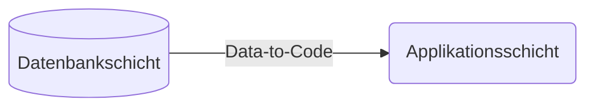
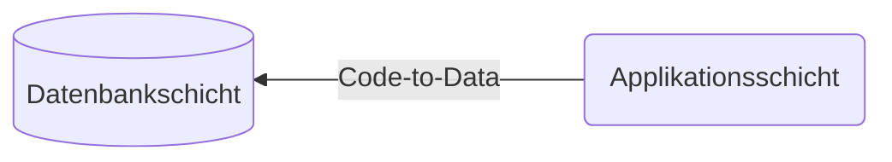

Das klassische Anwendungsdesign im SAP-Umfeld folgt dem Data-to-Code-Ansatz, was bedeutet, dass intensive Berechnungen in der Applikationsschicht durchgeführt werden.

Bei modernen Datenbankplattformen wie SAP HANA bietet sich jedoch ein datensatzorientierter Ansatz an. Bei diesem erfolgen die intensiven Berechnungen in der Datenbankschicht, weswegen dieser Ansatz auch als Code-to-Data-Ansatz bezeichnet wird.

Die Core Data Services sind eine Sammlung domänenspezifischer Sprachen und Services für die Definition und Nutzung semantisch reicher Datenmodelle:

- Mit Hilfe der _Data Definition Language_ (DDL) können Datenbanktabellen und Datenbankviews definiert werden
- Mit Hilfe der _Query Language_ (QL) können die Daten von Datenbanktabellen und Datenbankviews gelesen werden
- Mit Hilfe der _Data Control Language_ (DCL) können Zugriffsrechte definiert werden

Im Gegensatz zu den HANA CDS, welche spezifisch für SAP HANA entwickelt wurden, sind die ABAP CDS datenbankunabhängig.
