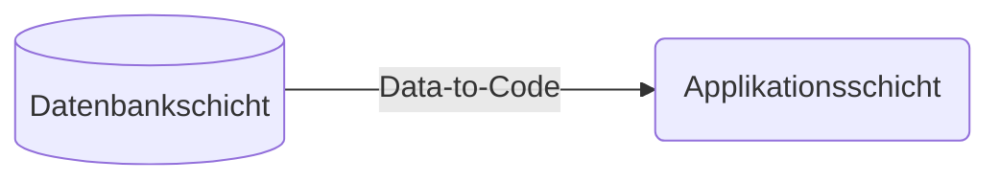
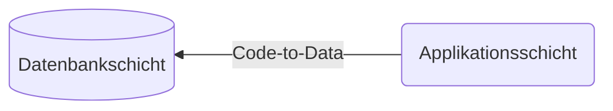

Das klassische Anwendungsdesign im SAP-Umfeld folgt dem Data-to-Code-Ansatz: Intensive Berechnungen werden in der Applikationsschicht durchgeführt.

```mermaid
flowchart LR
    database[(Datenbankschicht)] --Data-to-Code---> application(Applikationsschicht)
```

Bei modernen Datenbankplattformen wie SAP HANA bietet sich ein datensatzorientierter Ansatz an: Die intensiven Berechnungen finden in der Datenbankschicht statt – daher auch die Bezeichnung Code-to-Data-Ansatz.

```mermaid
flowchart RL
    application2(Applikationsschicht) --Code-to-Data---> database2[(Datenbankschicht)]
```

Die Core Data Services sind eine Sammlung domänenspezifischer Sprachen und Services zur Definition und Nutzung semantisch reicher Datenmodelle:

- Mit der _Data Definition Language_ (DDL) werden Datenbanktabellen und Datenbankviews definiert
- Mit der _Query Language_ (QL) werden Daten aus Datenbanktabellen und Datenbankviews gelesen
- Mit der _Data Control Language_ (DCL) werden Zugriffsrechte definiert

Im Gegensatz zu den HANA CDS, die spezifisch für SAP HANA entwickelt wurden, sind die ABAP CDS datenbankunabhängig.
