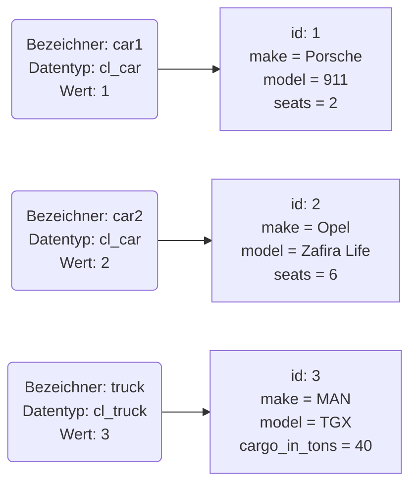
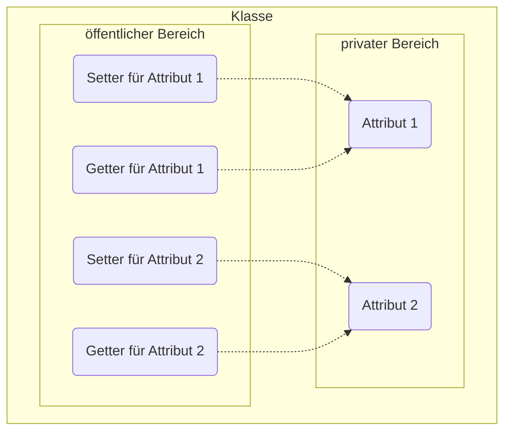

ABAP Objects stellt die objektorientierte Erweiterung von ABAP dar. Es enthält nur objektorientierte Konzepte, die sich in anderen objektorientierten Programmiersprachen bewährt haben und die in einem betriebswirtschaftlichen Umfeld sinnvoll sind.
gilt, dass ABAP-Objects-Anweisungen in prozeduralen ABAP-Programmen verwendet werden können.

:::tip Hinweis

Im objektorientierten Kontext gelten strengere Typprüfungen als in prozeduralen und obsolete Anweisungen werden als Syntaxfehler betrachtet.

:::

## Die Grundidee der Objektorientierung

In der objektorientierten Programmierung werden Beobachtungen aus der realen Welt zum Konzept der Objektorientierung zusammengefasst

- Eine Kategorie von ähnlichen Objekten bezeichnet man als _Klasse_
- Konkrete Ausprägungen bzw. Instanzen einer Klasse werden wiederum als _Objekte_ bezeichnet
- Die Eigenschaften von Objekten werden als _Attribute_, das Verhalten als _Methoden_ bezeichnet

:::tip Hinweis

Jedes Objekt ist eindeutig identifizierbar.

:::

## Datenkapselung

Ein wesentlicher Grundsatz der Objektorientierung ist, dass Attribute durch Methoden gekapselt werden. Datenkapselung bedeutet, dass Attribute nicht direkt geändert werden können, sondern nur durch den indirekten Zugriff über Methoden. Typische Methoden zum
Lesen und Schreiben von Attributen sind die sogenannten Getter- bzw. Setter-Methoden.

Um die Sichtbarkeit von Attributen und Methoden zu definieren, existieren unterschiedliche Zugriffsrechte. Die Sichtbarkeit bestimmt, von welchem Ort aus Attribute und Methoden verwendet bzw. aufgerufen werden dürfen.

| Zugriffsrecht | Zugriff aus gleicher Klasse | Zugriff von einer Unterklasse | Zugriff von einer beliebigen Klasse |
| ------------- | --------------------------- | ----------------------------- | ----------------------------------- |
| `public`      | Ja                          | Ja                            | Ja                                  |
| `protected`   | Ja                          | Ja                            | Nein                                |
| `private`     | Ja                          | Nein                          | Nein                                |
