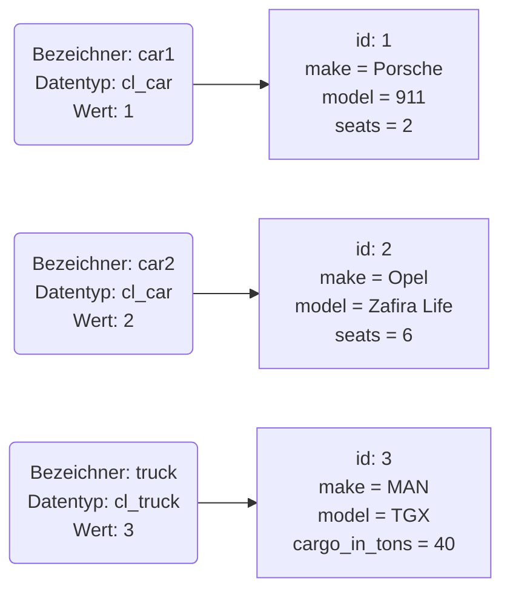
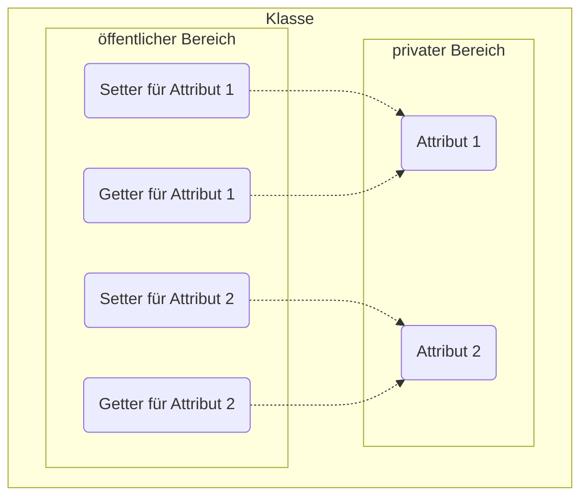

ABAP Objects ist die objektorientierte Erweiterung von ABAP. Es enthält ausschließlich objektorientierte Konzepte, die sich in anderen Sprachen bewährt haben und im betriebswirtschaftlichen Umfeld sinnvoll sind. Da ABAP Objects auf dem bestehenden ABAP-Stack aufbaut, können ABAP-Objects-Anweisungen auch in prozeduralen ABAP-Programmen verwendet werden – umgekehrt gilt das nicht für alle prozeduralen Konstrukte.

:::warning

Im objektorientierten Kontext gelten strengere Typprüfungen als in prozeduralen und obsolete Anweisungen werden als Syntaxfehler betrachtet.

:::

## Die Grundidee der Objektorientierung

In der objektorientierten Programmierung werden Beobachtungen aus der realen Welt abstrahiert:

- Eine Kategorie ähnlicher Objekte bezeichnet man als _Klasse_
- Konkrete Ausprägungen (Instanzen) einer Klasse nennt man _Objekte_
- Die Eigenschaften von Objekten heißen _Attribute_, ihr Verhalten _Methoden_

```mermaid
flowchart LR
    car1(Bezeichner: car1\nDatentyp: cl_car\nWert: 1) --> o1[id: 1\nmake = Porsche\nmodel = 911\nseats = 2]
    car2(Bezeichner: car2\nDatentyp: cl_car\nWert: 2) --> o2[id: 2\nmake = Opel\nmodel = Zafira Life\nseats = 6]
    truck(Bezeichner: truck\nDatentyp: cl_truck\nWert: 3) --> o3[id: 3\nmake = MAN\nmodel = TGX\ncargo_in_tons = 40]
```

:::note

Jedes Objekt ist eindeutig identifizierbar.

:::

## Datenkapselung

Ein wesentlicher Grundsatz der Objektorientierung ist, dass Attribute durch Methoden gekapselt werden. Das bedeutet: Attribute lassen sich nicht direkt ändern, sondern nur über Methoden. Typische Methoden zum Lesen und Schreiben von Attributen sind Getter- bzw. Setter-Methoden.

```mermaid
flowchart LR
   subgraph Klasse
      direction LR
      subgraph privater Bereich
         attribut1(Attribut 1)
         attribut2(Attribut 2)
      end
      subgraph öffentlicher Bereich
         setter1(Setter für Attribut 1) -.-> attribut1
         setter2(Setter für Attribut 2) -.-> attribut2
         getter1(Getter für Attribut 1) -.-> attribut1
         getter2(Getter für Attribut 2) -.-> attribut2
      end
   end
```

Um die Sichtbarkeit von Attributen und Methoden zu steuern, gibt es verschiedene Zugriffsrechte. Sie legen fest, von welchem Ort aus Attribute und Methoden genutzt bzw. aufgerufen werden dürfen.

| Zugriffsrecht | Zugriff aus gleicher Klasse | Zugriff von einer Unterklasse | Zugriff von einer beliebigen Klasse |
| ------------- | --------------------------- | ----------------------------- | ----------------------------------- |
| `public`      | Ja                          | Ja                            | Ja                                  |
| `protected`   | Ja                          | Ja                            | Nein                                |
| `private`     | Ja                          | Nein                          | Nein                                |
