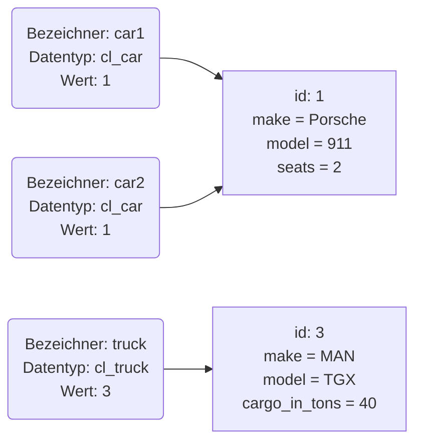

Variablen, die mit einer Klasse typisiert werden, bezeichnet man als Referenzvariablen. Im Gegensatz zu "normalen" Variablen werden bei Referenzvariablen keine elementaren Werte in den Variablen gespeichert, sondern die Speicheradressen der erzeugten Objekte,
also die Referenzen auf die erzeugten Objekte. Referenzvariablen werden mit dem Schlüsselwort `DATA` und dem Zusatz `TYPE REF TO` definiert.



```abap title="CL_MAIN.abap" showLineNumbers
CLASS cl_main DEFINITION PUBLIC FINAL CREATE PUBLIC.
  PUBLIC SECTION.
    INTERFACES if_oo_adt_classrun.
  PROTECTED SECTION.
  PRIVATE SECTION.
ENDCLASS.

CLASS cl_main IMPLEMENTATION.

  METHOD if_oo_adt_classrun~main.

    DATA vehicle TYPE REF TO cl_vehicle.
    DATA vehicles TYPE TABLE OF REF TO cl_vehicle.

  ENDMETHOD.

ENDCLASS.
```

Mit dem Operator `NEW` können Objekte erzeugt werden.

```abap title="CL_MAIN.abap" showLineNumbers
CLASS cl_main DEFINITION PUBLIC FINAL CREATE PUBLIC.
  PUBLIC SECTION.
    INTERFACES if_oo_adt_classrun.
  PROTECTED SECTION.
  PRIVATE SECTION.
ENDCLASS.

CLASS cl_main IMPLEMENTATION.

  METHOD if_oo_adt_classrun~main.

    DATA vehicle TYPE REF TO cl_vehicle.
    DATA vehicles TYPE TABLE OF REF TO cl_vehicle.

    vehicle = NEW cl_vehicle( make = 'Porsche' model = '911' ).
    vehicles = VALUE #( BASE vehicles ( vehicle ) ).

    vehicle = NEW cl_vehicle( make = 'MAN' model = 'TGX' ).
    vehicles = VALUE #( BASE vehicles ( vehicle ) ).

    vehicle = NEW cl_vehicle( make = 'Opel' model = 'Zafira Life' ).
    vehicles = VALUE #( BASE vehicles ( vehicle ) ).

  ENDMETHOD.

ENDCLASS.
```

:::tip Hinweis

Der Initialwert einer Referenzvariablen ist die leere Referenz.

:::

## Zugriff auf Attribute und Methoden

Der Zugriff auf "normale" Attribute und Methoden erfolgt über die Angabe der Referenzvariablen sowie den Objekt-Komponentenselektor `->`, der Zugriff auf Klassenelemente über die Angabe der Klasse sowie den Klassen-Komponentenselektor `=>`.

```abap title="CL_MAIN.abap" showLineNumbers
CLASS cl_main DEFINITION PUBLIC FINAL CREATE PUBLIC.
  PUBLIC SECTION.
    INTERFACES if_oo_adt_classrun.
  PROTECTED SECTION.
  PRIVATE SECTION.
ENDCLASS.

CLASS cl_main IMPLEMENTATION.

  METHOD if_oo_adt_classrun~main.

    DATA vehicle TYPE REF TO cl_vehicle.
    DATA vehicles TYPE TABLE OF REF TO cl_vehicle.

    LOOP AT vehicles INTO vehicle.
      out->write( vehicle->to_string( ) ).
    ENDLOOP.

  ENDMETHOD.

ENDCLASS.
```

:::tip Hinweis

ABAP arbeitet mit Schlüsselwortparametern, d.h. die Zuweisung eines Wertes erfolgt über die Angabe des Formalparameters. Besitzt eine Methode genau einen Import-Parameter, kann beim Aufruf der Methode der Formalparameter weggelassen werden.

:::
