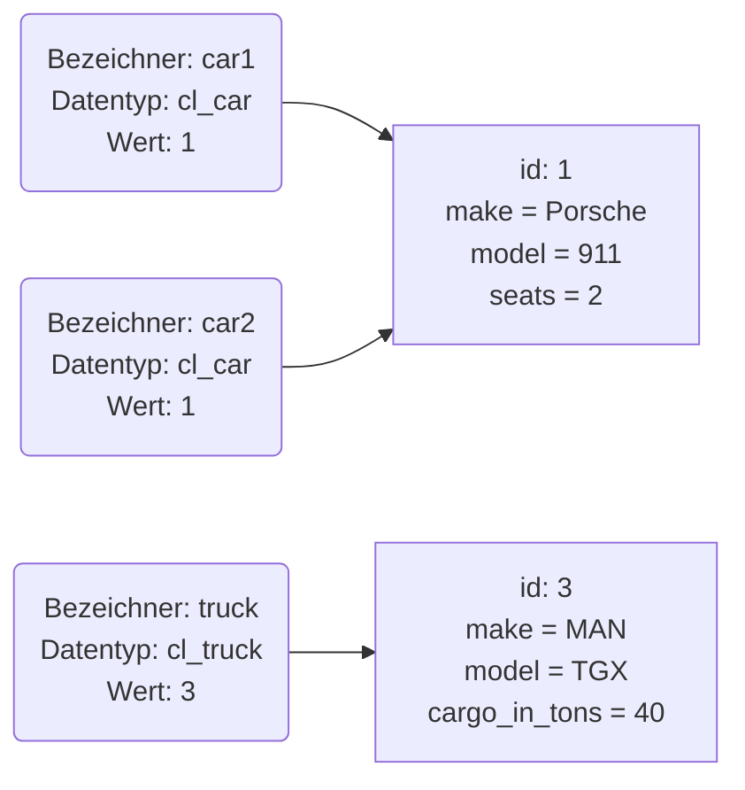

Variablen, die mit einer Klasse typisiert sind, nennt man Referenzvariablen. Im Gegensatz zu normalen Variablen speichern Referenzvariablen keine elementaren Werte, sondern die Speicheradressen der erzeugten Objekte – also Referenzen auf die Objekte. Referenzvariablen werden mit dem Schlüsselwort `DATA` und dem Zusatz `TYPE REF TO` deklariert.


```mermaid
flowchart LR
    car1(Bezeichner: car1\nDatentyp: cl_car\nWert: 1) --> o1[id: 1\nmake = Porsche\nmodel = 911\nseats = 2]
    car2(Bezeichner: car2\nDatentyp: cl_car\nWert: 1) --> o1[id: 1\nmake = Porsche\nmodel = 911\nseats = 2]
    truck(Bezeichner: truck\nDatentyp: cl_truck\nWert: 3) --> o3[id: 3\nmake = MAN\nmodel = TGX\ncargo_in_tons = 40]
```

```abap title="CL_MAIN.abap" showLineNumbers
CLASS cl_main DEFINITION PUBLIC FINAL CREATE PUBLIC.
  PUBLIC SECTION.
    INTERFACES if_oo_adt_classrun.
  PROTECTED SECTION.
  PRIVATE SECTION.
ENDCLASS.

CLASS cl_main IMPLEMENTATION.

  METHOD if_oo_adt_classrun~main.

    DATA vehicle TYPE REF TO cl_vehicle.
    DATA vehicles TYPE TABLE OF REF TO cl_vehicle.

  ENDMETHOD.

ENDCLASS.
```

Mit dem Operator `NEW` werden Objekte erzeugt.

```abap title="CL_MAIN.abap" showLineNumbers
CLASS cl_main DEFINITION PUBLIC FINAL CREATE PUBLIC.
  PUBLIC SECTION.
    INTERFACES if_oo_adt_classrun.
  PROTECTED SECTION.
  PRIVATE SECTION.
ENDCLASS.

CLASS cl_main IMPLEMENTATION.

  METHOD if_oo_adt_classrun~main.

    DATA vehicle TYPE REF TO cl_vehicle.
    DATA vehicles TYPE TABLE OF REF TO cl_vehicle.

    vehicle = NEW cl_vehicle( make = 'Porsche' model = '911' ).
    vehicles = VALUE #( BASE vehicles ( vehicle ) ).

    vehicle = NEW cl_vehicle( make = 'MAN' model = 'TGX' ).
    vehicles = VALUE #( BASE vehicles ( vehicle ) ).

    vehicle = NEW cl_vehicle( make = 'Opel' model = 'Zafira Life' ).
    vehicles = VALUE #( BASE vehicles ( vehicle ) ).

  ENDMETHOD.

ENDCLASS.
```

:::note

Der Initialwert einer Referenzvariablen ist die leere Referenz.

:::

## Zugriff auf Attribute und Methoden

Auf normale Attribute und Methoden wird über die Referenzvariable und den Objekt-Komponentenselektor `->` zugegriffen. Auf Klassenelemente wird über den Klassennamen und den Klassen-Komponentenselektor `=>` zugegriffen.

```abap title="CL_MAIN.abap" showLineNumbers
CLASS cl_main DEFINITION PUBLIC FINAL CREATE PUBLIC.
  PUBLIC SECTION.
    INTERFACES if_oo_adt_classrun.
  PROTECTED SECTION.
  PRIVATE SECTION.
ENDCLASS.

CLASS cl_main IMPLEMENTATION.

  METHOD if_oo_adt_classrun~main.

    DATA vehicle TYPE REF TO cl_vehicle.
    DATA vehicles TYPE TABLE OF REF TO cl_vehicle.

    LOOP AT vehicles INTO vehicle.
      out->write( vehicle->to_string( ) ).
    ENDLOOP.

  ENDMETHOD.

ENDCLASS.
```

:::note

ABAP verwendet Schlüsselwortparameter: Die Wertzuweisung erfolgt über den Namen des Formalparameters. Hat eine Methode genau einen Import-Parameter, kann der Formalparameter beim Aufruf weggelassen werden.

:::
