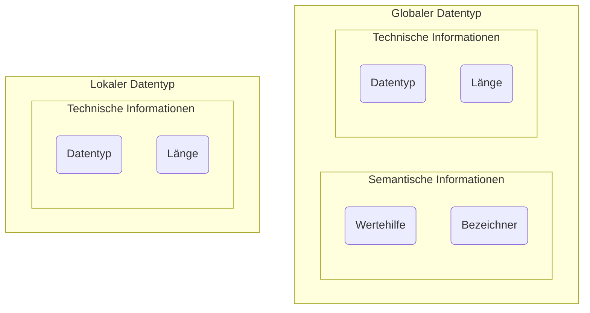

Datentypen legen fest, welche Art von Information ein Datenobjekt speichern kann. In ABAP werden sie zur Deklaration von Datenobjekten, zur Typisierung von Parametern in Funktionsbausteinen und Methoden sowie zur Deklaration von Ein- und Ausgabefeldern bei Dynpros verwendet.

## Wichtige ABAP-Standardtypen

In ABAP wird zwischen vollständigen und unvollständigen Datentypen unterschieden: Vollständige Datentypen haben eine vordefinierte Länge, unvollständige Datentypen erfordern bei der Deklaration eine Längenangabe.

### Vollständige Datentypen

Die folgenden vollständigen Datentypen stehen in ABAP standardmäßig zur Verfügung:

| Datentyp | Beschreibung                   | Dictionary Typ |
| -------- | ------------------------------ | -------------- |
| `D`      | Datum (Format:_YYYYMMDD_)      | `DATS`         |
| `T`      | Zeit (Format: _HHMMSS_)        | `TIMS`         |
| `I`      | Ganze Zahl                     | `INT4`         |
| `STRING` | Zeichenkette dynamischer Länge | `SSTRING`      |

### Unvollständige Datentypen

Die folgenden unvollständigen Datentypen erfordern bei der Deklaration eine Längenangabe:

| Datentyp | Beschreibung                  | Dictionary Typ | Zusatzwörter         |
| -------- | ----------------------------- | -------------- | -------------------- |
| `C`      | Zeichenkette fester Länge     | `CHAR`         | `LENGTH`             |
| `N`      | Numerische Folge fester Länge | `NUMC`         | `LENGTH`             |
| `P`      | Festpunktzahl                 | `DEC`          | `LENGTH`, `DECIMALS` |

## Lokale und globale Datentypen

In ABAP können Datentypen lokal oder global definiert werden: Lokale Datentypen existieren nur im jeweiligen Programm, globale Datentypen werden im Dictionary definiert und stehen systemweit zur Verfügung.


```mermaid
flowchart

    subgraph Globaler&#160Datentyp
        subgraph Semantische&#160Informationen
            valueHelp(Wertehilfe)
            label(Bezeichner)
        end
        subgraph Technische&#160Informationen
            type(Datentyp)
            length(Länge)
        end

    end

    subgraph Lokaler&#160Datentyp
        subgraph Technische&#160Informationen&#160
            type2(Datentyp)
            length2(Länge)
        end
    end
```

:::info

Globale Datentypen enthalten neben technischen auch semantische Informationen (z.B. Wertehilfen und Bezeichner).

:::

## Definition lokaler Datentypen

Lokale Datentypen werden mit dem Schlüsselwort `TYPES` definiert.

```abap showLineNumbers
TYPES t_c_40         TYPE c LENGTH 40.
TYPES t_n_7          TYPE n LENGTH 7.
TYPES t_decimal_16_2 TYPE p LENGTH 16 DECIMALS 2.
```
