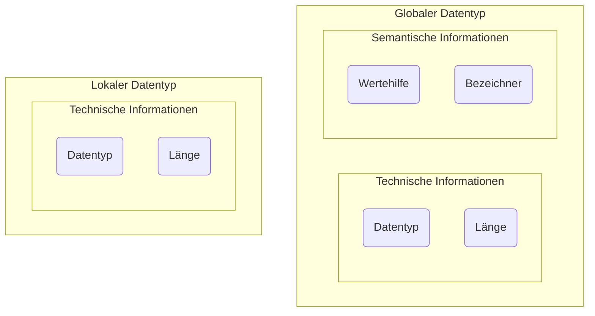

Datentypen legen fest, welche Art von Information ein Datenobjekt speichern kann. Die Verwendungsmöglichkeiten in ABAP umfassen die Deklaration von Datenobjekten, die Deklaration von Parametern bei Funktionsbausteinen und Methoden sowie die Deklaration von
Ein- und Ausgabefeldern bei Dynpros.

## Wichtige ABAP-Standardtypen

In ABAP wird zwischen vollständigen und unvollständigen Datentypen unterschieden: Vollständige Datentypen besitzen eine vordefinierte Länge, unvollständige Datentypen benötigen bei der Deklaration eine Längenangabe.

### Vollständige Datentypen

| Datentyp | Beschreibung                   |
| -------- | ------------------------------ |
| `D`      | Datum (Format:_YYYYMMDD_)      |
| `T`      | Zeit (Format: _HHMMSS_)        |
| `I`      | Ganze Zahl                     |
| `STRING` | Zeichenkette dynamischer Länge |

### Unvollständige Datentypen

| Datentyp | Beschreibung                  |
| -------- | ----------------------------- |
| `C`      | Zeichenkette fester Länge     |
| `N`      | Numerische Folge fester Länge |
| `P`      | Gepackte Zahl                 |

## Lokale und globale Datentypen

In ABAP können Datentypen lokal und global definiert werden: Lokale Datentypen existieren nur im betreffenden Programm und können auch nur dort verwendet werden, globale Datentypen werden im Dictionary definiert und können systemweit verwendet werden.

:::note Hinweis

Globale Datentypen besitzen neben technischen auch semantische Eigenschaften (z.B. Wertehilfen und Bezeichner).

:::
