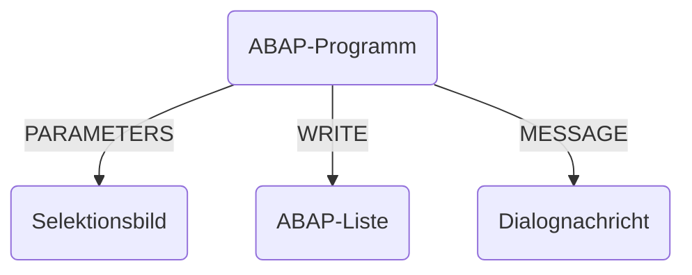

Klassische ABAP-Programme sind in ABAP geschriebene, ausführbare Entwicklungsobjekte. In klassischen ABAP-Programmen können Komponenten wie Selektionsbilder zur Eingabe von Daten sowie ABAP-Listen zur Ausgabe von Daten definiert werden. Klassische ABAP-Programme können als Hintergrundjobs eingerichtet werden, um z.B. Routineaufgaben zu automatisieren oder um den Einsatz der Rechenressourcen zu optimieren.



## Eingabe

Das Schlüsselwort `PARAMETERS` legt ein Datenobjekt an und erzeugt implizit ein Selektionsbild mit einem entsprechenden Eingabefeld. Der Zusatz `AS CHECKBOX` ermöglicht das Erzeugen von Kontrollkästchen, der Zusatz `RADIOBUTTON GROUP` das Erzeugen von
Auswahlschaltern.

```abap showLineNumbers
" Defintion of input fields
PARAMETERS p_carrid TYPE s_carr_id DEFAULT 'LH'.
PARAMETERS p_connid TYPE s_conn_id DEFAULT '0400'.

" Definition of checkboxes
PARAMETERS p_chckbx TYPE c AS CHECKBOX.

" Definition of radio buttons
PARAMETERS p_rdbtn1 TYPE c RADIOBUTTON GROUP grp.
PARAMETERS p_rdbtn2 TYPE c RADIOBUTTON GROUP grp.

IF p_chckbx = 'X'.
  WRITE: p_carrid, p_connid .
ENDIF.
```

:::tip Hinweis

Eine Wertvorbelegung wird bei Eingabeparametern nicht über den Zusatz `VALUE`, sondern über den Zusatz `DEFAULT` realisiert.

:::

## Ausgabe

Das Schlüsselwort `WRITE` bereitet den Inhalt des Datenobjektes auf und gibt diesen auf der aktuellen ABAP-Liste aus.

```abap showLineNumbers
PARAMETERS p_carrid TYPE s_carr_id.
PARAMETERS p_connid TYPE s_conn_id.

WRITE 'Flight Connection'.
ULINE.
WRITE: 'Carrier ID', 'Connection ID'.
WRITE: / p_carrid UNDER 'Carrier ID',
         p_connid UNDER 'Connection ID'.
```

:::tip Hinweis

Weitere Schlüsselwörter zur Definition der Ausgabe sind z.B. `NEW-LINE`, `SKIP` und `ULINE`.

:::

## Dialognachrichten

Mit der Anweisung `MESSAGE` können Dialognachrichten an den Benutzer geschickt werden. ABAP kennt die Nachrichtentypen _Information_ (I), _Setznachricht_ (S), _Warnung_ (W), _Fehler_ (E), _Abbruch_ (A) sowie _Kurzdump_ (X). Platzhalter in der angegebenen
Nachricht können durch den Zusatz `WITH` versorgt werden.

```abap showLineNumbers
PARAMETERS p_carrid TYPE s_carr_id.

IF p_carrid IS INITIAL.
  MESSAGE e000(flight) WITH p_carrid.
ENDIF.
```

## Textelemente

ABAP kennt verschiedene Arten von Textelementen:

- Textsymbole ermöglichen die Übersetzung von statischen Texten
- Selektionstexte dienen als Beschriftungen für Eingabeparameter

```abap showLineNumbers
" Text literal
WRITE 'Hello World'.

" Text symbol
WRITE: / 'Hello World'(000).
WRITE: / TEXT-000.
```

:::tip Hinweis

Ist ein Eingabeparameter mit einem Datenelement typisiert, kann der Feldbezeichner des Datenelements als Selektionstext übernommen werden.

:::

## ABAP-Ereignisse

Beim Starten eines ABAP Programms werden nacheinander verschiedene Ereignisse ausgelöst. Existiert zu einem Ereignis ein Verarbeitungsblock, wird dieser sequenziell ausgeführt:

- Das Ereignis `INIZIALIZATION` kann für dynamische Wertevorbelegungen genutzt werden
- Das Ereignis `AT SELECTION-SCREEN` kann für Eingabeprüfungen verwendet werden
- Die Hauptverarbeitung findet im Ereignis `START-OF-SELECTION` statt

```abap showLineNumbers
" Definitions and Declarations
PARAMETERS p_from TYPE s_airp_from.
PARAMETERS p_to TYPE s_airp_to.
PARAMETERS p_date TYPE s_date.

" Dynamic Assignments
INITIALIZATION.
  IF sy-langu = 'D'.
    p_from = 'FRA'.
    p_to = 'JFK'.
  ENDIF.

" Input checks
AT SELECTION-SCREEN ON p_date.
  IF p_date = sy-datlo .
    MESSAGE e001(flight) WITH p_date.
  ENDIF.

" Data Processing
START-OF-SELECTION.
  WRITE: p_from, p_to, p_date.
```

:::tip Hinweis

Die Hauptverarbeitung wird erst bei fehlerfreier Abarbeitung aller Eingabeprüfungen durchlaufen.

:::
