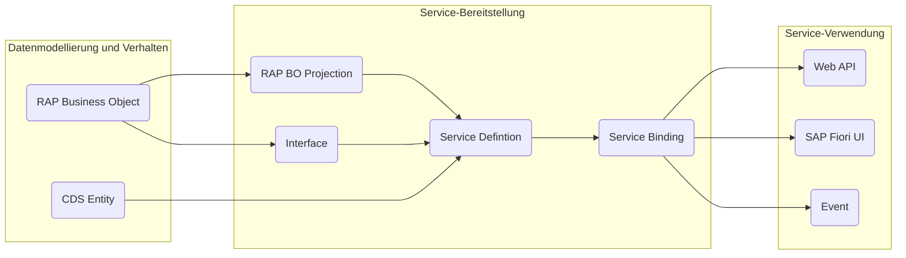
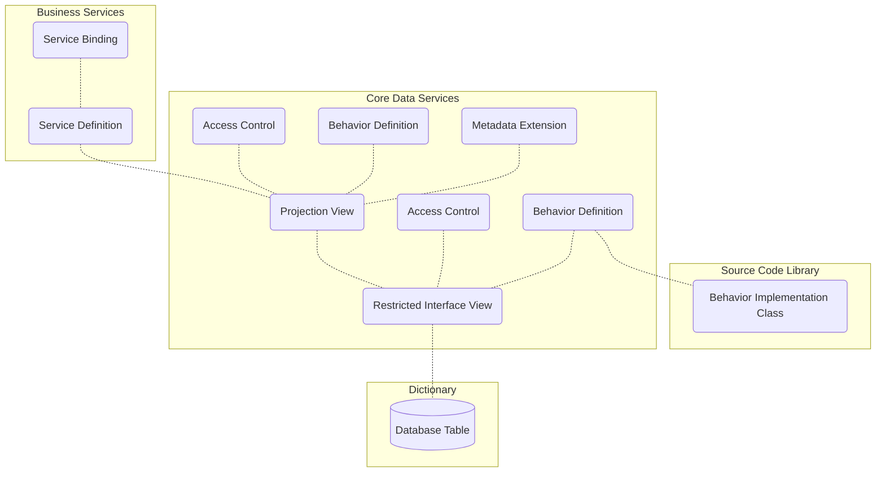

Das mittlerweile als _klassische ABAP Programmiermodell_ bekannte ABAP Programmiermodell wurde urspünglich für die Anwendungsentwicklung für SAP R/3 entworfen. Es setzt überwiegend auf klassische SAP-Technologien wie klassisches ABAP, klassische Datenbankviews sowie klassische ABAP-Programme, Dynpros und WebDynpros. Für die Anwendungsentwicklung in SAP S/4HANA wurde ein neues Programmiermodell, das sogenannte _ABAP Programmiermodell für SAP Fiori_ entwickelt. Dieses unterstützt die Entwicklung verschiedener Fiori-Anwendungen wie Transaktions-, Such-, Analyse- und Planungs-Apps und basiert auf erprobten Technologien wie ABAP CDS zur Definition semantisch reichhaltiger Datenmodelle, dem OData-Protokoll, dem Business Object Processing Framework (BOPF) sowie SAPUI5-basierten Benutzeroberflächen. Das _ABAP RESTful Application Programming Model_ (RAP) wiederum stellt eine konsequente Weiterentwicklung des ABAP Programmiermodells für SAP Fiori dar und wird vor allem für die Anwendungsentwicklung in SAP S/4HANA (Cloud) verwendet. Es unterstützt die Entwicklung aller Arten von SAP Fiori Apps, Web APIs sowie Events und basiert auf erprobten Technologien und Frameworks wie den Core Data Services (CDS) zur Definition semantisch reichhaltiger Datenmodelle sowie einer Service-Infrastruktur zur Erstellung von OData-Services.

|                         | Classic ABAP         | ABAP Programming Model for SAP Fiori | ABAP RESTful Application Programming Model (RAP) |
| ----------------------- | -------------------- | ------------------------------------ | ------------------------------------------------ |
| Applikationsserver      | SAP NetWeaver        | SAP NetWeaver                        | SAP NetWeaver, SAP BTP - ABAP Environment        |
| Entwicklungsumgebung    | SAPUI, ADT           | SAPGUI, ADT, SAP BAS                 | ADT, SAP BAS                                     |
| Release Fokus           | SAP R/3              | SAP S/4HANA                          | SAP S/4HANA (Cloud)                              |
| Datenmodellierung       | Data Dictionary      | ABAP CDS                             | ABAP CDS                                         |
| Service-Definition      | SEGW                 | SEGW, @OData                         | Business Service                                 |
| Service-Implementierung | Classic ABAP, BOPF   | ABAP, ABAP CDS, BOPF                 | ABAP, ABAP CDS, RAP BO                           |
| Oberflächen             | Report, (Web-)Dynpro | SAPUI5                               | SAPUI5                                           |

## Architektur einer RAP-Anwendung

Die Architektur einer RAP-Anwendung umfasst die nachfolgenden Bereiche:

**Datenmodellierung und Verhalten**

- _RAP Business Objects_ (RAP BOs) legen das Datenmodell für transaktionale Anwendungen fest und beinhalten neben den Daten auch die datenbezogene Logik, also das Verhalten
- _CDS Entities_ ermöglichen die Definition von nicht-transaktionalen Datenmodellen, die für Abfragen verwendet werden können

**Service-Bereitstellung**

- _RAP BO Projections_ und _Interfaces_ ermöglichen die Definition spezifischer Geschäftsservices
- _Service Definitions_ legen den Umfang eines Geschäftsservices fest
- _Service Bindings_ legen das Kommunikationsprotokoll (OData v2 oder OData v4) sowie die Art des Geschäftsservices (UI, Web API oder Event) fest

**Service-Verwendung**

- _SAP Fiori UIs_ stellen Oberflächen für häufig verwendete Anwendungsmuster bereit
- _Web APIs_ bieten eine öffentliche Schnittstelle für den Zugriff auf die Geschäftsservices
- _Events_ ermöglichen das asynchrone Konsumieren von RAP BOs

## Laufzeitartefakte einer RAP-Anwendung

Für die Entwicklung von SAP Fiori Apps nach RAP kommen nachfolgende Laufzeitartefakte zum Einsatz:

- _Restricted Interface Views_ und _Projection Views_ legen das Datenmodell des RAP BOs fest
- _Metadata Extensions_ legen die Oberfläche fest
- _Access Controls_ steuern die Lesezugriffe
- _Behavior Definitions_ legen das transaktionale Verhalten des RAP BOs fest
- _Behavior Implementation Classes_ beinhalten die Verhaltensimplementierungen
- _Service Definitions_ legen den Umfang des Business Services fest
- _Service Bindings_ legen das Kommunikationsprotokoll sowie die Art des Business Services fest

