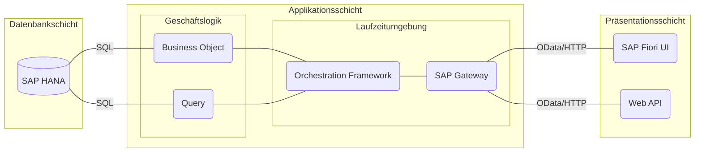

Diese Webseite und die dazugehörigen Lehrveranstaltungen bieten eine systematische Einführung in die Anwendungsentwicklung in SAP S/4HANA. Der Schwerpunkt liegt auf der Entwicklung transaktionaler SAP Fiori Elements Apps mit praxisrelevanten Konzepten und Methoden.

## Architektur von SAP S/4HANA

Sowohl SAP S/4HANA als auch SAP S/4HANA Cloud basieren auf einem klassischen 3-Schichten-Modell:

- Die _Datenbankschicht_ verwaltet die Daten
- Die _Applikationsschicht_ enthält die Geschäfts- bzw. Servicelogik
- Die _Präsentationsschicht_ stellt die Daten dar und ermöglicht die Interaktion mit dem Anwender

Als Datenbank kommt in beiden Varianten SAP HANA zum Einsatz, die Präsentation erfolgt über SAP Fiori UIs bzw. Web APIs. Als Applikationsserver nutzt SAP S/4HANA einen SAP NetWeaver, SAP S/4HANA Cloud die ABAP Environment der SAP BTP.

```mermaid
flowchart RL
   bo --SQL--- saphana
   query --SQL--- saphana
   orchestrationframework --- bo
   orchestrationframework --- query
   sapgateway --- orchestrationframework
   sapfioriui --OData/HTTP--- sapgateway
   webapi --OData/HTTP --- sapgateway
   subgraph Datenbankschicht
      saphana[(SAP HANA)]
   end
   subgraph Applikationsschicht
      subgraph Geschäftslogik
         bo(Business Object)
         query(Query)
      end
      subgraph Laufzeitumgebung
         sapgateway(SAP Gateway)
         orchestrationframework(Orchestration Framework)
      end
   end
   subgraph Präsentationsschicht
      sapfioriui(SAP Fiori UI)
      webapi(Web API)
   end
```

## Evolution des ABAP Programmiermodells

Das heute als _klassisches ABAP Programmiermodell_ bekannte Modell wurde ursprünglich für die Anwendungsentwicklung in SAP R/3 entworfen. Es setzt überwiegend auf klassische SAP-Technologien wie klassisches ABAP, klassische Datenbankviews, ABAP-Programme, Dynpros und WebDynpros. Für SAP S/4HANA entstand das _ABAP Programmiermodell für SAP Fiori_, das auf ABAP CDS zur Definition semantisch reichhaltiger Datenmodelle, dem OData-Protokoll, dem Business Object Processing Framework (BOPF) und SAPUI5-basierten Benutzeroberflächen aufbaut. Es unterstützt verschiedene Fiori-Anwendungstypen wie Transaktions-, Such-, Analyse- und Planungs-Apps. Das _ABAP RESTful Application Programming Model_ (RAP) ist die konsequente Weiterentwicklung dieses Modells und wird vor allem für die Anwendungsentwicklung in SAP S/4HANA (Cloud) eingesetzt.

Die folgende Tabelle gibt einen Überblick über die wichtigsten Merkmale der drei Programmiermodelle im Vergleich:

|                         | Classic ABAP         | ABAP Programming Model for SAP Fiori | ABAP RESTful Application Programming Model (RAP) |
| ----------------------- | -------------------- | ------------------------------------ | ------------------------------------------------ |
| Applikationsserver      | SAP NetWeaver        | SAP NetWeaver                        | SAP NetWeaver, SAP BTP - ABAP Environment        |
| Entwicklungsumgebung    | SAPUI, ADT           | SAPGUI, ADT, SAP BAS                 | ADT, SAP BAS                                     |
| Release Fokus           | SAP R/3              | SAP S/4HANA                          | SAP S/4HANA (Cloud)                              |
| Datenmodellierung       | Data Dictionary      | ABAP CDS                             | ABAP CDS                                         |
| Service-Definition      | SEGW                 | SEGW, @OData                         | Business Service                                 |
| Service-Implementierung | Classic ABAP, BOPF   | ABAP, ABAP CDS, BOPF                 | ABAP, ABAP CDS, RAP BO                           |
| Oberflächen             | Report, (Web-)Dynpro | SAPUI5                               | SAPUI5                                           |
