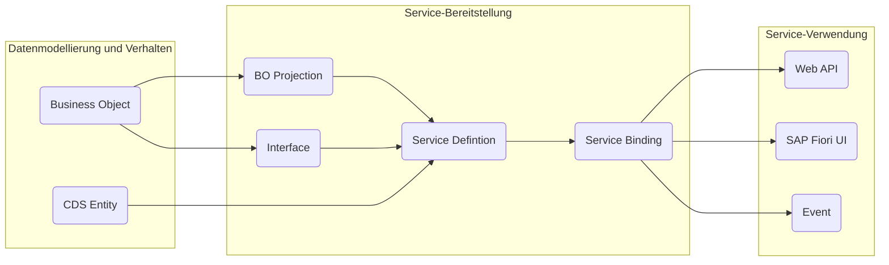

Diese Webseite sowie die dazugehörigen Schulungen bzw. die dazugehörige Vorlesung sollen eine systematische Einführung in die Anwendungsentwicklung in SAP S/4HANA ermöglichen. Hierzu werden wichtige, praxisrelevante Konzepte und Methoden der Anwendungsentwicklung vorgestellt, wobei der Fokus auf der Entwicklung transaktionaler SAP Fiori elements Apps liegt.

## Architektur von SAP S/4HANA

Sowohl SAP S/4HANA als auch SAP S/4HANA Cloud basieren auf einem klassischen 3-Schichten-Modell:

- Die _Datenbankschicht_ ist für die Verwaltung der Daten zuständig
- Die _Applikationsschicht_ ist für die Geschäfts- bzw. Servicelogik zuständig
- Die _Präsentationsschicht_ ist für die Darstellung der Daten sowie die Interaktion mit dem Anwender zuständig

Technologisch setzen sowohl SAP S/4HANA als auch SAP S/4HANA Cloud auf eine SAP HANA als Datenbank sowie auf SAP Fiori UIs bzw. Web APIs zur Präsentation. In SAP S/4HANA kommt als Applikationsserver ein SAP NetWeaver, bei SAP S/4HANA Cloud die ABAP Environment der SAP BTP zum Einsatz.

## Evolution des ABAP Programmiermodells

Das mittlerweile als _klassische ABAP Programmiermodell_ bekannte ABAP Programmiermodell wurde urspünglich für die Anwendungsentwicklung für SAP R/3 entworfen. Es setzt überwiegend auf klassische SAP-Technologien wie klassisches ABAP, klassische Datenbankviews sowie klassische ABAP-Programme, Dynpros und WebDynpros. Für die Anwendungsentwicklung in SAP S/4HANA wurde ein neues Programmiermodell, das sogenannte _ABAP Programmiermodell für SAP Fiori_ entwickelt. Dieses unterstützt die Entwicklung verschiedener Fiori-Anwendungen wie Transaktions-, Such-, Analyse- und Planungs-Apps und basiert auf erprobten Technologien wie ABAP CDS zur Definition semantisch reichhaltiger Datenmodelle, dem OData-Protokoll, dem Business Object Processing Framework (BOPF) sowie SAPUI5-basierten Benutzeroberflächen. Das _ABAP RESTful Application Programming Model_ (RAP) wiederum stellt eine konsequente Weiterentwicklung des ABAP Programmiermodells für SAP Fiori dar und wird vor allem für die Anwendungsentwicklung in SAP S/4HANA (Cloud) verwendet.

|                         | Classic ABAP         | ABAP Programming Model for SAP Fiori | ABAP RESTful Application Programming Model (RAP) |
| ----------------------- | -------------------- | ------------------------------------ | ------------------------------------------------ |
| Applikationsserver      | SAP NetWeaver        | SAP NetWeaver                        | SAP NetWeaver, SAP BTP - ABAP Environment        |
| Entwicklungsumgebung    | SAPUI, ADT           | SAPGUI, ADT, SAP BAS                 | ADT, SAP BAS                                     |
| Release Fokus           | SAP R/3              | SAP S/4HANA                          | SAP S/4HANA (Cloud)                              |
| Datenmodellierung       | Data Dictionary      | ABAP CDS                             | ABAP CDS                                         |
| Service-Definition      | SEGW                 | SEGW, @OData                         | Business Service                                 |
| Service-Implementierung | Classic ABAP, BOPF   | ABAP, ABAP CDS, BOPF                 | ABAP, ABAP CDS, RAP BO                           |
| Oberflächen             | Report, (Web-)Dynpro | SAPUI5                               | SAPUI5                                           |

## Architektur einer RAP-Anwendung

Die Architektur einer RAP-Anwendung umfasst die nachfolgenden Bereiche:

**Datenmodellierung und Verhalten**

- _Business Objects_ (BOs) legen das Datenmodell für transaktionale Anwendungen fest und beinhalten neben den Daten auch die datenbezogene Logik, also das Verhalten
- _CDS Entities_ ermöglichen die Definition von nicht-transaktionalen Datenmodellen, die für Abfragen verwendet werden können

**Service-Bereitstellung**

- _BO Projections_ und _Interfaces_ ermöglichen die Definition spezifischer Geschäftsservices
- _Service Definitions_ legen den Umfang eines Geschäftsservices fest
- _Service Bindings_ legen das Kommunikationsprotokoll (OData v2 oder OData v4) sowie die Art des Geschäftsservices (UI, Web API oder Event) fest

**Service-Verwendung**

- _SAP Fiori UIs_ stellen Oberflächen für häufig verwendete Anwendungsmuster bereit
- _Web APIs_ bieten eine öffentliche Schnittstelle für den Zugriff auf die Geschäftsservices
- _Events_ ermöglichen das asynchrone Konsumieren von RAP BOs

## Laufzeitartefakte einer RAP-Anwendung

Für die Entwicklung von SAP Fiori Apps nach RAP kommen nachfolgende Laufzeitartefakte zum Einsatz:

- Kategorie _Dictionary_
  - _Transparenete Tabellen_ legen den Aufbau der Datenbanktabellen fest
- Kategorie _Core Data Services_
  - _BO Base Views_ legen das Datenmodell des BOs fest
  - _BO Projection Views_ und _Behavior Projections_ legen den Business Service fest
  - _Metadata Extensions_ legen die Oberfläche fest
  - _Access Controls_ steuern die Lesezugriffe
  - _Behavior Definitions_ und _Behavior Projections_ legen das transaktionale Verhalten des BOs fest
- Kategorie _Business Ervices_
  - _Service Definitions_ legen den Umfang des Business Services fest
  - _Service Bindings_ legen das Kommunikationsprotokoll sowie die Art des Business Services fest
- Kategorie _Source Code Library_
  - _Verhaltensimplementierungen_ beinhalten die Implementierungen des transaktionalen Verhaltens
