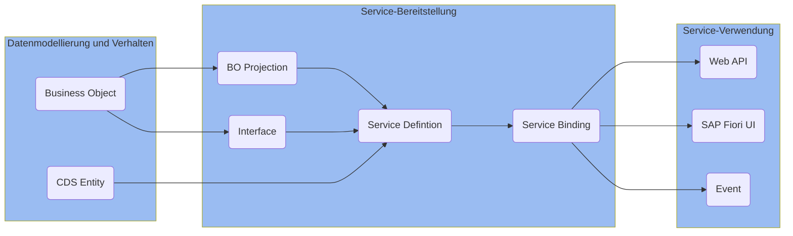
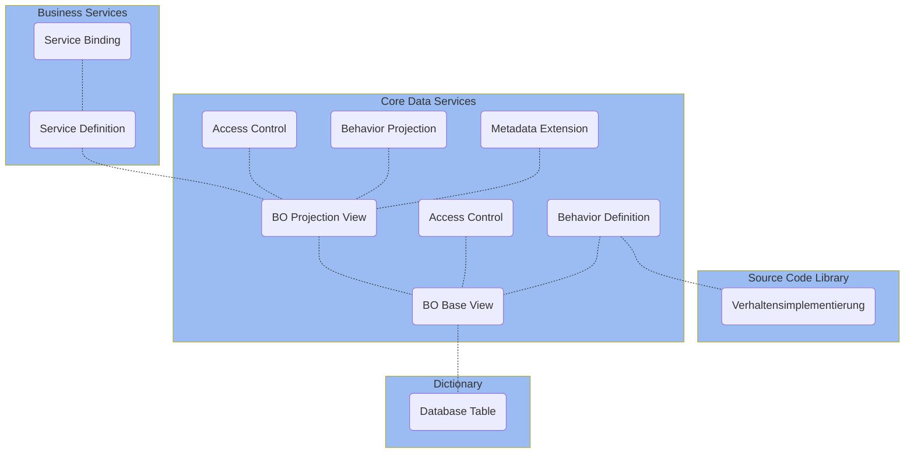

Das _ABAP RESTful Application Programming Model_ (RAP) wird vor allem für die Anwendungsentwicklung in SAP S/4HANA (Cloud) verwendet. Es unterstützt die Entwicklung aller Arten von SAP Fiori Apps, Web APIs sowie Events und basiert auf erprobten Technologien und Frameworks wie den Core Data Services (CDS) zur Definition semantisch reichhaltiger Datenmodelle sowie einer Service-Infrastruktur zur Erstellung von OData-Services.

## Architektur einer RAP-Anwendung

Die Architektur einer RAP-Anwendung umfasst die nachfolgenden Bereiche:

**Datenmodellierung und Verhalten**

- _Business Objects_ (BOs) legen das Datenmodell für transaktionale Anwendungen fest und beinhalten neben den Daten auch die datenbezogene Logik, also das Verhalten
- _CDS Entities_ ermöglichen die Definition von nicht-transaktionalen Datenmodellen, die für Abfragen verwendet werden können

**Service-Bereitstellung**

- _BO Projections_ und _Interfaces_ ermöglichen die Definition spezifischer Geschäftsservices
- _Service Definitions_ legen den Umfang eines Geschäftsservices fest
- _Service Bindings_ legen das Kommunikationsprotokoll (OData v2 oder OData v4) sowie die Art des Geschäftsservices (UI, Web API oder Event) fest

**Service-Verwendung**

- _SAP Fiori UIs_ stellen Oberflächen für häufig verwendete Anwendungsmuster bereit
- _Web APIs_ bieten eine öffentliche Schnittstelle für den Zugriff auf die Geschäftsservices
- _Events_ ermöglichen das asynchrone Konsumieren von RAP BOs

## Laufzeitartefakte einer RAP-Anwendung

Für die Entwicklung von SAP Fiori Apps nach RAP kommen nachfolgende Laufzeitartefakte zum Einsatz:

- _BO Base Views_ legen das Datenmodell des BOs fest
- _Behavior Definitions_ legen das transaktionale Verhalten des BOs fest
- _Metadata Extensions_ legen die Oberfläche fest
- _Access Controls_ steuern die Lesezugriffe
- _Verhaltensimplementierungen_ beinhalten die Implementierungen des transaktionalen Verhaltens
- _BO Projection Views_ und _Behavior Projections_ legen den Business Service fest
- _Service Definitions_ legen den Umfang des Business Services fest
- _Service Bindings_ legen das Kommunikationsprotokoll sowie die Art des Business Services fest

