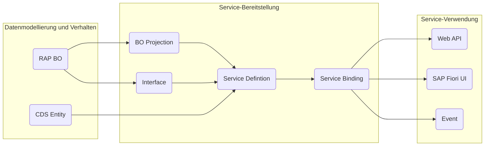

Die Architektur einer RAP-Anwendung umfasst die nachfolgenden Bereiche:

**Datenmodellierung und Verhalten**

- _RAP Business Objects_ (RAP BOs) legen das Datenmodell für transaktionale Anwendungen fest und beinhalten neben den Daten auch die datenbezogene Logik, also das Verhalten
- _CDS Entities_ ermöglichen die Definition von nicht-transaktionalen Datenmodellen, die für Abfragen verwendet werden können

**Service-Bereitstellung**

- _BO Projections_ und _BO Interfaces_ ermöglichen die Definition spezifischer Geschäftsservices bzw. Interfaces
- _Service Definitions_ legen den Umfang eines Geschäftsservices fest
- _Service Bindings_ legen das Kommunikationsprotokoll (OData v2 oder OData v4) sowie die Art des Geschäftsservices (UI, Web API oder Event) fest

**Service-Verwendung**

- _SAP Fiori UIs_ stellen Oberflächen für häufig verwendete Anwendungsmuster bereit
- _Web APIs_ bieten eine öffentliche Schnittstelle für den Zugriff auf die Geschäftsservices
- _Events_ ermöglichen das asynchrone Konsumieren von RAP BOs

