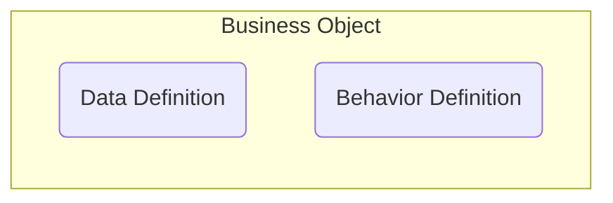
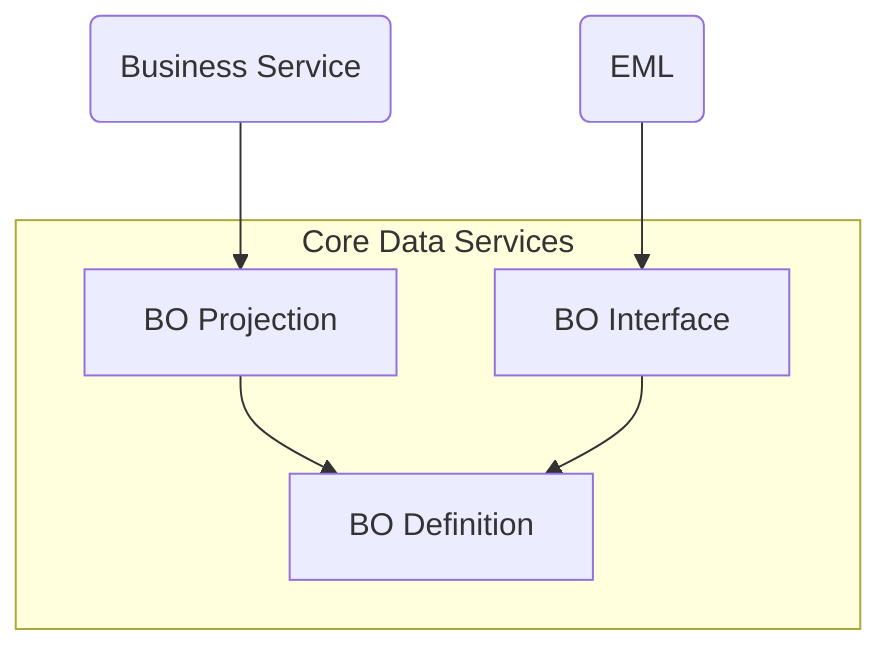

Ein RAP Business Object (RAP BO) bildet eine konrekte Entität ab und stellt die transaktionale Logik dieser Entität für Fiori Elements Apps und Web APIs zur Verfügung.
Ein RAP BO besteht dabei aus einer _Data Definition_, welche die Struktur des RAP BOs festlegt sowie einer _Behavior Definition_, welche das transaktionale Verhalten festlegt.



## Struktur eines RAP BOs

Ein RAP BO besteht immer aus einer Wurzelentität und beliebig vielen Unterentitäten. Die Beziehung zwischen einer Kindentität und der jeweiligen Elternentität entspricht einer Komposition; die Beziehung selbst wird in Form spezieller Assoziationen abgebildet, wobei die entsprechende Join-Bedinung nur in der Kindentität angegeben werden muss.

Im Beispiel stellt eine Flugverbindung die Wurzelentität und ein Flug die Unterentität dar. Die Beziehung zwischen der Flugverbindung und dem Flug entspricht dabei einer 1-n-Beziehung.

```sql showLineNumbers
define view entity ZR_FlightTP
  as select from ZI_Flight
  association to parent ZR_ConnectionTP as _Connection
    on  $projection.CarrierId    = _Connection.CarrierId
    and $projection.ConnectionId = _Connection.ConnectionId
{
  key CarrierId,
  key ConnectionId,
  key FlightDate,

      Price,
      CurrencyCode,

      /* Associations */
      _Connection
}
```

```sql showLineNumbers
define root view entity ZR_ConnectionTP
  as select from ZI_Connection
  composition [0..*] of ZR_FlightTP as _Flights
{
  key CarrierId,
  key ConnectionId,

      AirportFromId,
      AirportToId,

      /* Associations */
      _Flights
}
```

:::tip Hinweis

Die Wurzelentität wird mit dem Schlüsselwort `root` kenntlich gemacht.

:::

## Verhalten eines RAP BOs

Eine _Behavior Definition_ besitzt für jede Entität des RAP BOs einen entsprechenden Abschnitt, in welchem das transaktionale Verhalten festgelegt werden kann:

- Standard-Datenoperationen (Create, Update, Delete, Create By)
- Spezielle Operationen (Actions)
- Prüfungen (Validations)
- Berechnungen (Determinations)
- Sperren (Locks)
- Berechtigungsprüfungen (Authority Checks)
- Feldkontrollen (Pflichtfelder, Anzeigefelder)

```sql showLineNumbers
managed implementation in class zbp_connectiontp unique;
strict ( 2 );

define behavior for ZR_ConnectionTP alias Connection
persistent table /dmo/connection
lock master
authorization master ( instance )
//etag master <field_name>
{
  create ( authorization : global );
  update;
  delete;
  association _Flights { create; }

  validation ValidateCarrierId on save { create; }
  validation ValidateAirportIds on save { create; }

  action AddFlight parameter ZA_Flight result [1] entity ZR_FLightTP;

  field ( readonly ) CarrierId, ConnectionId;
  field ( mandatory : create ) AirportFromId, AirportToId;
  field ( readonly : update ) AirportFromId, AirportToId;

  mapping for /dmo/connection corresponding
    {
      AirportFromId = airport_from_id;
      AirportToId   = airport_to_id;
      CarrierId     = carrier_id;
      ConnectionId  = connection_id;
    }
}

define behavior for ZR_FLightTP alias Flight
persistent table /dmo/flight
lock dependent by _Connection
authorization dependent by _Connection
//etag master <field_name>
{
  update;
  delete;
  association _Connection;

  field ( readonly ) CarrierId, ConnectionId, CurrencyCode, FlightDate;
  field ( mandatory ) Price;

  validation ValidatePrice on save { field Price; }
  determination DetermineCurrencyCode on save { create; }

  mapping for /dmo/flight corresponding
    {
      CarrierId    = carrier_id;
      ConnectionId = connection_id;
      CurrencyCode = currency_code;
      FlightDate   = flight_date;
    }
}
```

## Verwenden von RAP BOs

Der Zugriff auf RAP BOs kann entweder über einen Geschäftsservice oder über ABAP mit Hilfe der _Entity Manpipulation Lanaguage_ (EML) realisiert werden. Der Zugriff sollte dabei nicht direkt auf das BO, sondern über
BO Projections (bei Geschäftsservices) bzw. BO Interfaces (bei EML) erfolgen. Der so erfolgte Zugriff auf das RAP BO ermöglicht das Lesen, Erzeugen, Ändern und Löschen von Daten auf Datenbankebene.


