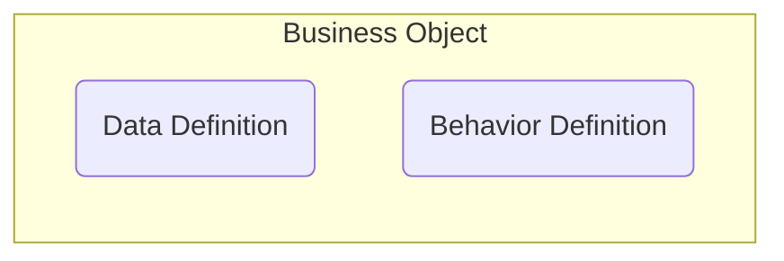
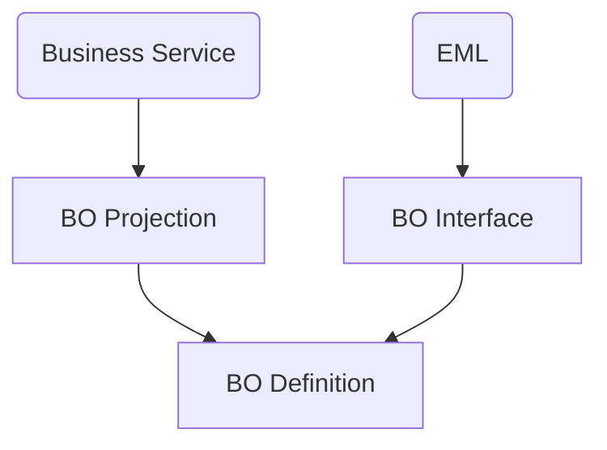

Ein RAP Business Object (RAP BO) bildet eine konrekte Entität ab und stellt die transaktionale Logik dieser Entität für Fiori Elements Apps und Web APIs zur Verfügung.
Ein RAP BO besteht dabei aus einer _Data Definition_, welche die Struktur des RAP BOs festlegt sowie einer _Behavior Definition_, welche das transaktionale Verhalten (Create, Update, Delete, Actions, Validations und Determinations) festlegt.

Der Zugriff auf RAP BOs kann entweder über einen Geschäftsservice oder über ABAP mit Hilfe der _Entity Manpipulation Lanaguage_ (EML) erfolgen. Der Zugriff sollte dabei nicht direkt auf das BO, sondern über
BO Projections (bei Geschäftsservices) bzw. BO Interfaces (bei EML) erfolgen. Der so erfolte Zugriff auf das RAP BO ermöglicht das Lesen, Erzeugen, Ändern und Löschen von Daten auf Datenbankebene.

