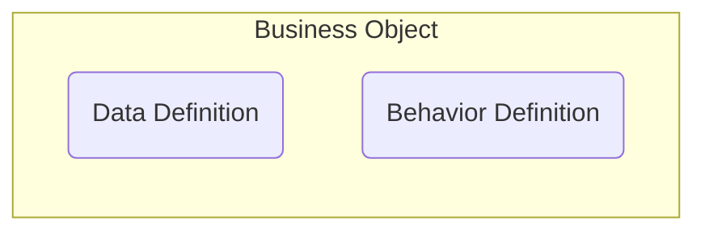
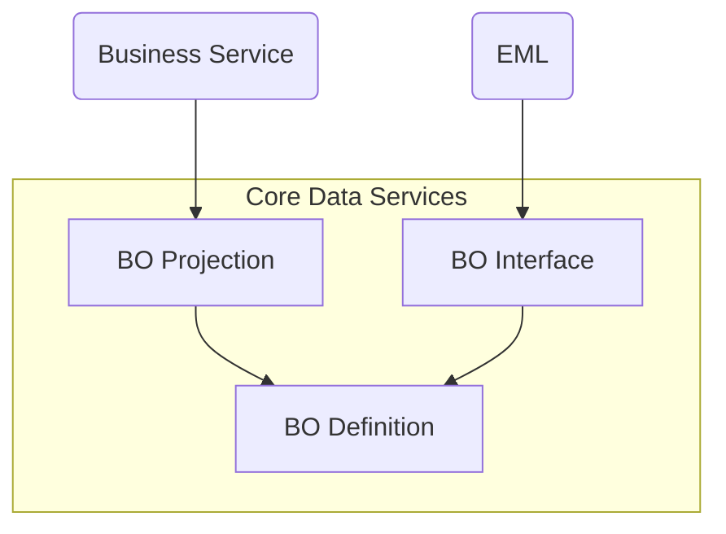

Ein RAP Business Object (RAP BO) bildet eine konkrete Entität ab und stellt deren transaktionale Logik für Fiori Elements Apps und Web APIs bereit.
Ein RAP BO besteht aus einer _Data Definition_, die die Struktur festlegt, und einer _Behavior Definition_, die das transaktionale Verhalten definiert.


```mermaid
flowchart LR
  subgraph Business Object
    data_definition(Data Definition)
    behavior_definition(Behavior Definition)
  end
```

## Struktur eines RAP BOs

Ein RAP BO besteht immer aus einer Wurzelentität und beliebig vielen Unterentitäten. Die Beziehung zwischen einer Kindentität und der jeweiligen Elternentität ist eine Komposition; sie wird über spezielle Assoziationen abgebildet, wobei die Join-Bedingung nur in der Kindentität angegeben werden muss.

Im folgenden Beispiel ist die Flugverbindung die Wurzelentität und der Flug die Unterentität. Sie stehen in einer 1-n-Beziehung zueinander. Zunächst wird die Unterentität `ZR_FlightTP` mit der Assoziation zur Elternentität definiert:

```sql showLineNumbers
define view entity ZR_FlightTP
  as select from ZI_Flight
  association to parent ZR_ConnectionTP as _Connection
    on  $projection.CarrierId    = _Connection.CarrierId
    and $projection.ConnectionId = _Connection.ConnectionId
{
  key CarrierId,
  key ConnectionId,
  key FlightDate,

      Price,
      CurrencyCode,

      /* Associations */
      _Connection
}
```

Anschließend wird die Wurzelentität `ZR_ConnectionTP` mit der Komposition zur Unterentität definiert:

```sql showLineNumbers
define root view entity ZR_ConnectionTP
  as select from ZI_Connection
  composition [0..*] of ZR_FlightTP as _Flights
{
  key CarrierId,
  key ConnectionId,

      AirportFromId,
      AirportToId,

      /* Associations */
      _Flights
}
```

:::note

Die Wurzelentität wird mit dem Schlüsselwort `root` kenntlich gemacht.

:::

## Verhalten eines RAP BOs

Eine _Behavior Definition_ enthält für jede Entität des RAP BOs einen eigenen Abschnitt, in dem das transaktionale Verhalten festgelegt werden kann:

- Standard-Datenoperationen (Create, Update, Delete, Create By)
- Spezielle Operationen (Actions)
- Prüfungen (Validations)
- Berechnungen (Determinations)
- Sperren (Locks)
- Berechtigungsprüfungen (Authority Checks)
- Feldkontrollen (Pflichtfelder, Anzeigefelder)

```sql showLineNumbers
managed implementation in class zbp_connectiontp unique;
strict ( 2 );

define behavior for ZR_ConnectionTP alias Connection
persistent table /dmo/connection
lock master
authorization master ( instance )
//etag master <field_name>
{
  create ( authorization : global );
  update;
  delete;
  association _Flights { create; }

  validation ValidateCarrierId on save { create; }
  validation ValidateAirportIds on save { create; }

  action AddFlight parameter ZA_Flight result [1] entity ZR_FlightTP;

  field ( readonly ) CarrierId, ConnectionId;
  field ( mandatory : create ) AirportFromId, AirportToId;
  field ( readonly : update ) AirportFromId, AirportToId;

  mapping for /dmo/connection corresponding
    {
      AirportFromId = airport_from_id;
      AirportToId   = airport_to_id;
      CarrierId     = carrier_id;
      ConnectionId  = connection_id;
    }
}

define behavior for ZR_FlightTP alias Flight
persistent table /dmo/flight
lock dependent by _Connection
authorization dependent by _Connection
//etag master <field_name>
{
  update;
  delete;
  association _Connection;

  field ( readonly ) CarrierId, ConnectionId, CurrencyCode, FlightDate;
  field ( mandatory ) Price;

  validation ValidatePrice on save { field Price; }
  determination DetermineCurrencyCode on save { create; }

  mapping for /dmo/flight corresponding
    {
      CarrierId    = carrier_id;
      ConnectionId = connection_id;
      CurrencyCode = currency_code;
      FlightDate   = flight_date;
    }
}
```

## Implementierungsarten

RAP unterscheidet zwei Implementierungsarten, die zu Beginn der Behavior Definition festgelegt werden:

- Bei **managed** übernimmt das RAP-Framework die Standard-Datenbankoperationen (Create, Update, Delete) automatisch. Lediglich die Sonderfälle wie Validierungen, Determinierungen und Actions müssen implementiert werden. Das ist der Standardfall für neue Anwendungen.
- Bei **unmanaged** werden alle Datenbankoperationen selbst implementiert. Diese Variante ist vor allem dann sinnvoll, wenn eine bestehende Geschäftslogik in RAP integriert werden soll und nicht auf das Framework-Standardverhalten zurückgegriffen werden kann.

## Zugriff auf RAP BOs

Auf RAP BOs kann entweder über einen Geschäftsservice oder mit ABAP und der _Entity Manipulation Language_ (EML) zugegriffen werden. Der Zugriff sollte dabei nicht direkt auf das BO erfolgen, sondern über BO Projections (bei Geschäftsservices) bzw. BO Interfaces (bei EML). Damit wird eine saubere Trennung zwischen Konsumenten und der internen BO-Struktur gewährleistet — Änderungen am BO wirken sich nicht direkt auf die Konsumenten aus.


```mermaid
flowchart
  service(Business Service)
  eml(EML)
  subgraph Core Data Services
    projection[BO Projection]
    interface[BO Interface]
    definition[BO Definition]
  end

  service --> projection
  eml --> interface
  projection --> definition
  interface --> definition
```
