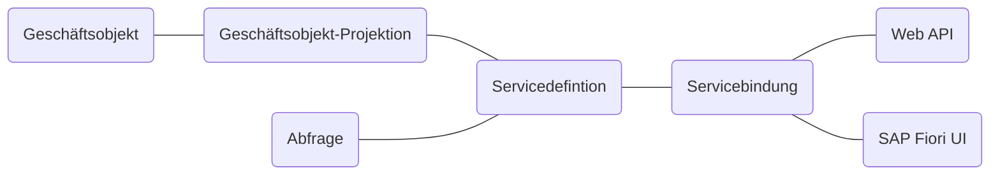

Das _ABAP RESTful Application Programming Model_ (RAP) definiert die Architektur für die Anwendungsentwicklung in SAP S/4HANA und SAP S/4HANA Cloud. Es unterstützt die Entwicklung aller Arten von Fiori-Apps sowie Web-APIs und basiert auf erprobten Technologien und Frameworks wie den Core Data Services (CDS) zur Definition semantisch reichhaltiger Datenmodelle sowie einer Service-Infrastruktur zur Erstellung von OData-Services. Die Architektur einer RAP-Anwendung umfasst dabei die nachfolgenden Bereiche:

- _Geschäftsobjekte_ stellen das Datenmodell dar und definieren das Verhalten, also die datenbezogene Logik. Sie werden über ABAP-CDS-Views, Verhaltensdefinitionen sowie Verhaltensimplementierungen festgelegt
- _Geschäftsobjekt-Projektionen_ ermöglichen das Festlegen spezifischer Geschäftsobjekte für einen bestimmten Geschäftsservice. Sie bestehen aus ABAP-CDS-Projektionsviews, Verhaltensprojektionen sowie spezifischen Implementierungen
- _Servicedefinitionen_ legen den Umfang eines Geschäftsservices fest. Dies umfasst insbesondere die Geschäftsobjekt-Projektionen, die der Geschäftsservice bereitstellen soll
- _Servicebindungen_ legen das Kommunikationsprotokoll (OData v2 oder OData v4) sowie die Art des Geschäftsservices (UI oder Web API) fest
- _SAP FioriUIs_ stellen Oberflächen für häufig verwendete Anwendungsmuster bereit
- _Web APIs_ bieten eine öffentliche Schnittstelle für den Zugriff auf die Services

