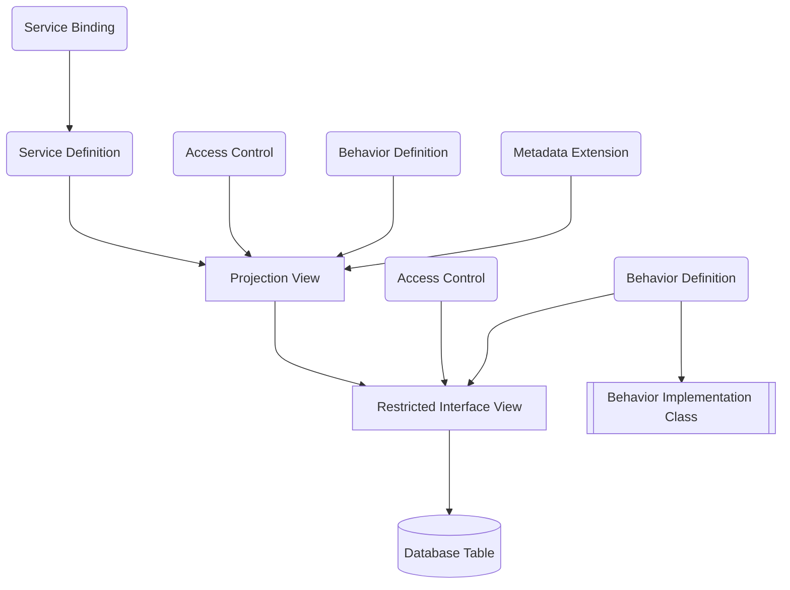

Für die Entwicklung von SAP-Fiori-Apps nach RAP kommen nachfolgende Laufzeitartefakte zum Einsatz:

- _Restricted Interface Views_ und _Projection Views_ legen das Datenmodell fest
- _Metadata Extensions_ legen die Oberfläche fest
- _Access Controls_ steuern die Lesezugriffe
- _Behavior Definitions_ legen das transaktionale Verhalten fest
- _Behavior Implementation Classes_ beinhalten die Verhaltensimplementierungen
- _Service Definitions_ legen den Umfang fest
- _Service Bindings_ legen das Kommunikationsprotokoll sowie die Art des Geschäftsservices fest

