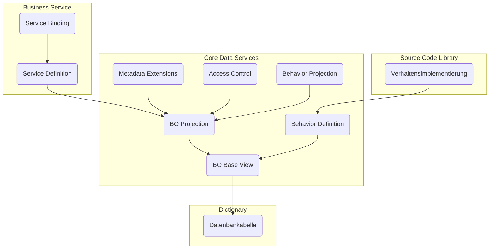

Für die Entwicklung von SAP Fiori Apps nach RAP kommen nachfolgende Laufzeitartefakte zum Einsatz:

**Kategorie _Dictionary_**

- _Datenbanktabellen_ legen das Datenmodell fest

**Kategorie _Core Data Services_**

- _BO Base Views_ und _BO Projection Views_ legen das Datenmodell des RAP BOs fest
- _Behavior Definitions_ und _Behavior Projections_ legen das transaktionale Verhalten des RAP BOs fest
- _Metadata Extensions_ legen die Oberfläche fest
- _Access Controls_ steuern die Lesezugriffe

**Kategorie _Business Services_**

- _Service Definitions_ legen den Umfang des Geschäftsservices fest
- _Service Bindings_ legen das Kommunikationsprotokoll sowie die Art des Geschäftsservices fest

**Kategorie _Source Code Library_**

- _Verhaltensimplementierungen_ beinhalten die Implementierungen des transaktionalen Verhaltens

