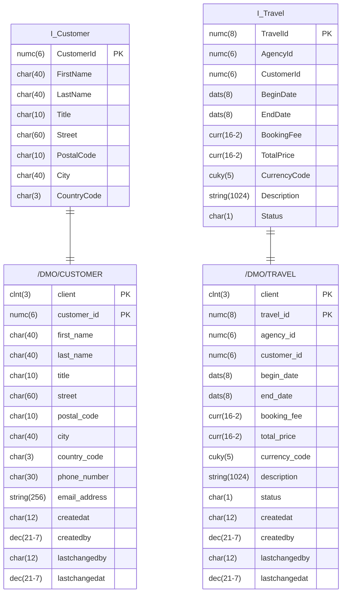

Erstelle mit Hilfe des abgebildeten ER-Modells die ABAP CDS Views `ZI_???_Travel` und `ZI_???_Customer`.

## ER-Modell

```mermaid
erDiagram

    I_Customer ||--|| "/DMO/CUSTOMER" : ""
    I_Travel ||--|| "/DMO/TRAVEL" : ""

    I_Customer {
        numc(6) CustomerId PK
        char(40) FirstName
        char(40) LastName
        char(10) Title
        char(60) Street
        char(10) PostalCode
        char(40) City
        char(3) CountryCode
    }

    "/DMO/CUSTOMER" {
        clnt(3) client PK
        numc(6) customer_id PK
        char(40) first_name
        char(40) last_name
        char(10) title
        char(60) street
        char(10) postal_code
        char(40) city
        char(3) country_code
        char(30) phone_number
        string(256) email_address
        char(12) createdat
        dec(21-7) createdby
        char(12) lastchangedby
        dec(21-7) lastchangedat
    }

    I_Travel {
        numc(8) TravelId PK
        numc(6) AgencyId
        numc(6) CustomerId
        dats(8) BeginDate
        dats(8) EndDate
        curr(16-2) BookingFee
        curr(16-2) TotalPrice
        cuky(5) CurrencyCode
        string(1024) Description
        char(1) Status
    }

    "/DMO/TRAVEL" {
        clnt(3) client PK
        numc(8) travel_id PK
        numc(6) agency_id
        numc(6) customer_id
        dats(8) begin_date
        dats(8) end_date
        curr(16-2) booking_fee
        curr(16-2) total_price
        cuky(5) currency_code
        string(1024) description
        char(1) status
        char(12) createdat
        dec(21-7) createdby
        char(12) lastchangedby
        dec(21-7) lastchangedat
    }
```
