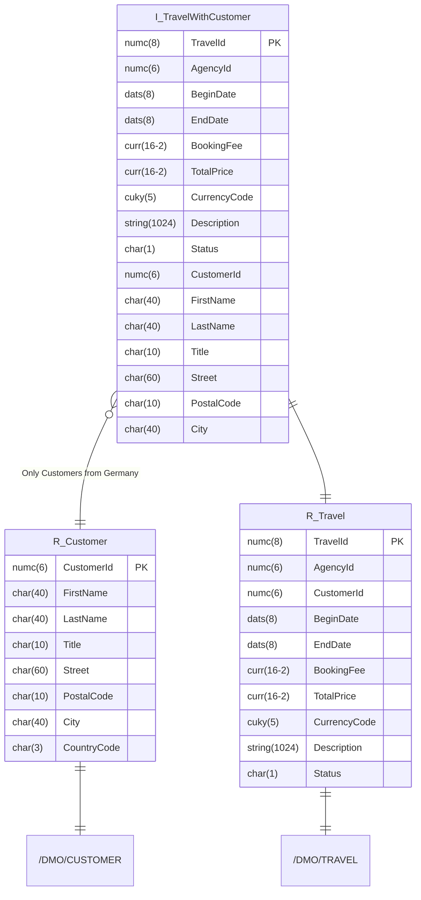

Erstelle mit Hilfe des abgebildeten ER-Modells die ABAP CDS View `Z???_I_TravelWithCustomer`.

## ER-Modell

## Hinweis

Die Verknüpfung der beiden Datenquellen `ZR_???_Travel` und `ZR_???_Customer` soll in Form eines Inner Joins erfolgen.
