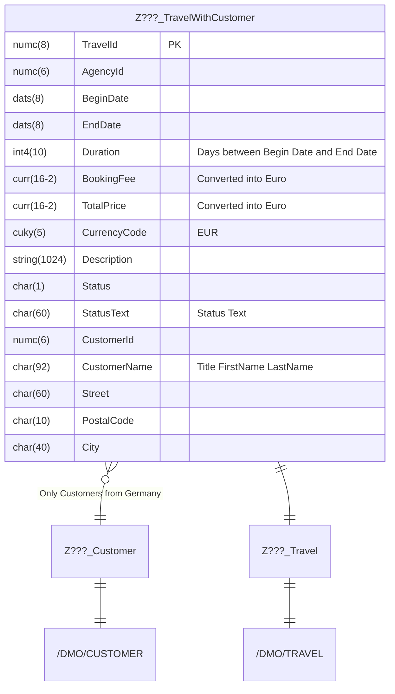

Passe mit Hilfe des abgebildeten ER-Modells die ABAP CDS View `Z???_TravelWithCustomer` an.

## Grafische Ansicht

## Hinweise

- Das Feld `Duration` soll die Reisedauer ausgeben
- Das Feld `CustomerName` soll, falls eine Anrede vorhanden ist, die verketteten Felder `Title`, `FirstName` und `LastName` ausgeben, ansonsten nur die verketteten Felder `FirstName` und `LastName`
- Die Felder `BookingFee` und `TotalPrice` sollen die Beträge in Euro ausgeben (Stichtag: aktuelles Systemdatum)
- Das Feld `CurrencyCode` soll den Wert `EUR` ausgeben
- Das Feld `StatusText` soll den Text des Domänenfestwerts des Feldes `Status` in der Anmeldesprache ausgeben
