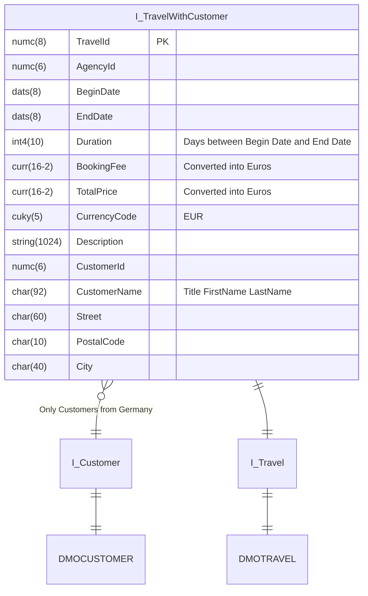

Passe mit Hilfe des abgebildeten ER-Modells die ABAP CDS View `ZI_???_TravelWithCustomer` an.

## Grafische Ansicht

## Hinweise

- Das Feld `Duration` soll die Reisedauer ausgeben
- Das Feld `CustomerName` soll, falls eine Anrede vorhanden ist, die verketteten Felder `Titel`, `Erster Name` und `Letzter Name` ausgeben, ansonsten nur die verketteten Felder `Erster Name` und `Letzter Name`
- Die Felder `BookingFee` und `TotalPrice` sollen die Beträge in Euro ausgeben (Stichtag: Beginn der Reise)
- Das Feld `CurrencyCode` soll den Wert `EUR` ausgeben
