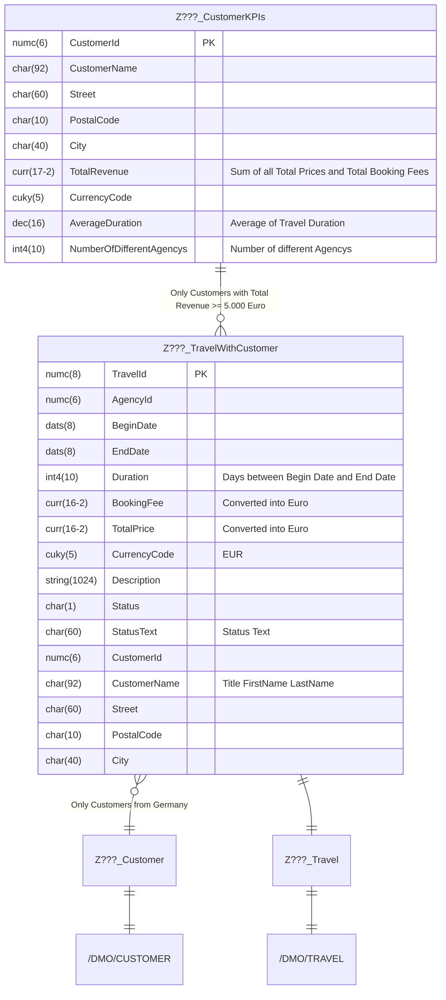

Erstelle mit Hilfe des abgebildeten ER-Modells die ABAP CDS View `Z???_CustomerKPIs`.

## ER-Modell

## Hinweise

- Das Feld `TotalRevenue` soll den gesamten Umsatz aller Reisen eines Kunden ausgeben
- Das Feld `AverageDuration` soll die durchschnittliche Reisedauer ausgeben
- Das Feld `NumberOfDifferentAgencys` soll die Anzahl unterschiedlicher Reisebüros eines Kunden ausgeben
