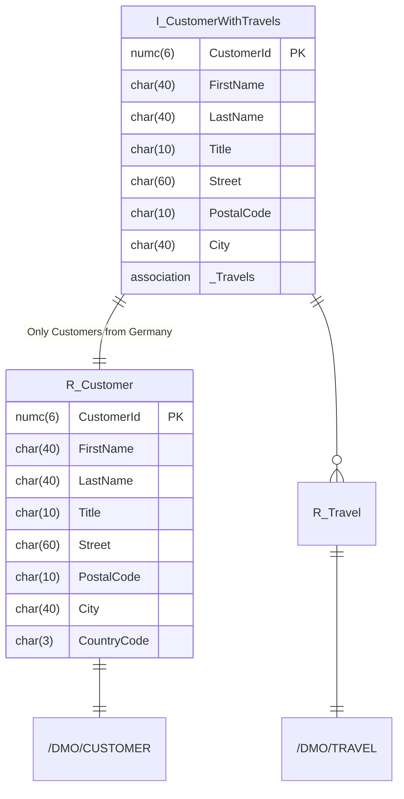

1. Erstelle mit Hilfe des abgebildeten ER-Modells die ABAP CDS View `ZI_???_CustomerWithTravels`
2. Erstelle die ausführbare Klasse `ZCL_???_ABAP_CDS_07`, welche alle Kunden samt den dazugehörigen Reiseinformationen liest und anzeigt. Verwende zum Lesen der Daten die ABAP CDS View aus Aufgabenteil 1

## ER-Modell

