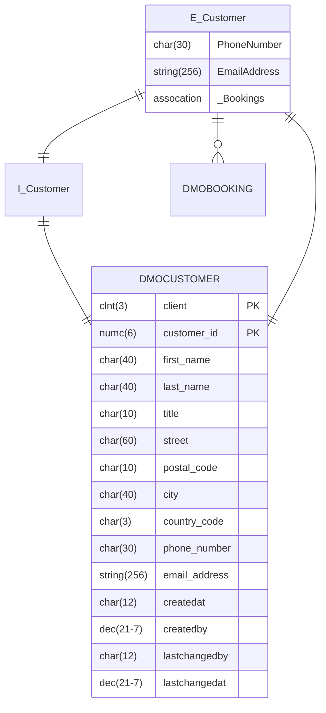

Erstelle mit Hilfe des abgebildeten ER-Modells die ABAP CDS View `ZE_???_Customer`.

## ER-Modell

```mermaid
erDiagram

    I_Customer ||--|| DMOCUSTOMER : ""
    E_Customer ||--|| I_Customer  : ""
    E_Customer ||--|| DMOCUSTOMER : ""
    E_Customer ||--o{ DMOBOOKING : ""

    I_Customer {
    }

    E_Customer {
        char(30) PhoneNumber
        string(256) EmailAddress
        assocation _Bookings
    }

    DMOCUSTOMER {
        clnt(3) client PK
        numc(6) customer_id PK
        char(40) first_name
        char(40) last_name
        char(10) title
        char(60) street
        char(10) postal_code
        char(40) city
        char(3) country_code
        char(30) phone_number
        string(256) email_address
        char(12) createdat
        dec(21-7) createdby
        char(12) lastchangedby
        dec(21-7) lastchangedat
    }
```
