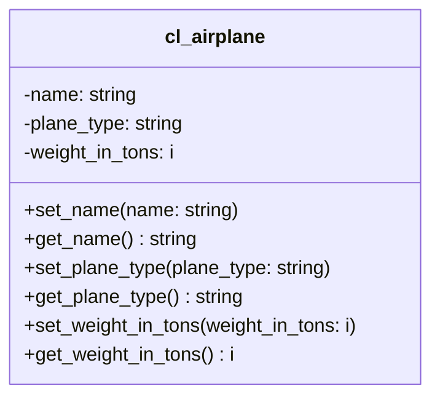

Erstelle die Klasse `ZCL_???_AIRPLANE` anhand des abgebildeten Klassendiagramms.

## Klassendiagramm

```mermaid
classDiagram
   class cl_airplane {
      -name: string
      -plane_type: string
      -weight_in_tons: i
      +set_name(name: string)
      +get_name() string
      +set_plane_type(plane_type: string)
      +get_plane_type() string
      +set_weight_in_tons(weight_in_tons: i)
      +get_weight_in_tons() i
   }
```
