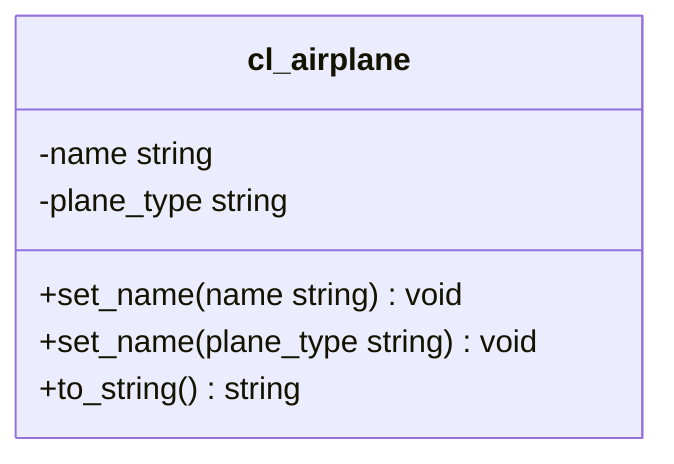

Erstelle die Klasse `ZCL_???_AIRPLANE` anhand des abgebildeten Klassendiagramms.

## Klassendiagramm

## Hinweise zur Klasse `ZCL_???_AIRPLANE`

Die Methode `VOID TO_STRING()` soll alle Instanzattribute zu einer Zeichenkette zusammenfassen und diese zurückgeben
