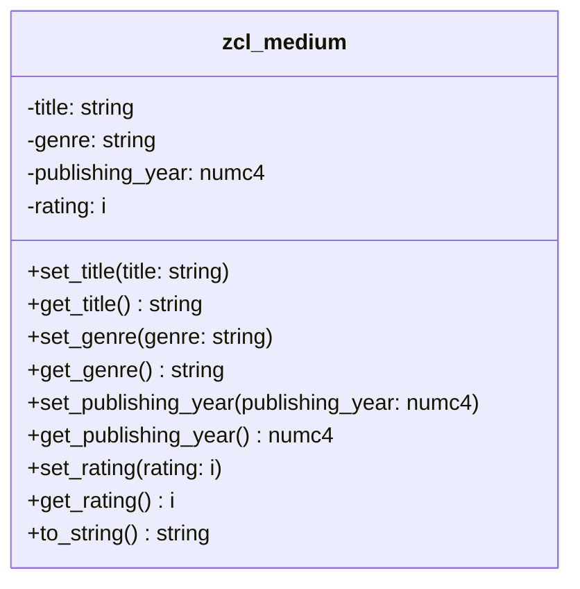

Erstelle die Klasse `ZCL_???_MEDIUM` anhand des abgebildeten Klassendiagramms.

## Klassendiagramm

```mermaid
classDiagram
   class zcl_medium {
      -title: string
      -genre: string
      -publishing_year: numc4
      -rating: i 
      +set_title(title: string)
      +get_title() string
      +set_genre(genre: string)
      +get_genre() string
      +set_publishing_year(publishing_year: numc4)
      +get_publishing_year() numc4
      +set_rating(rating: i)
      +get_rating() i
      +to_string() string
   }
```

## Hinweis zur Klasse `ZCL_???_MEDIUM`

Die Methode `TO_STRING` soll alle Attribute als Zeichenkette in der Form _[Titel], [Genre], [Erscheinungsjahr], [Bewertung]_ zurückgeben.
