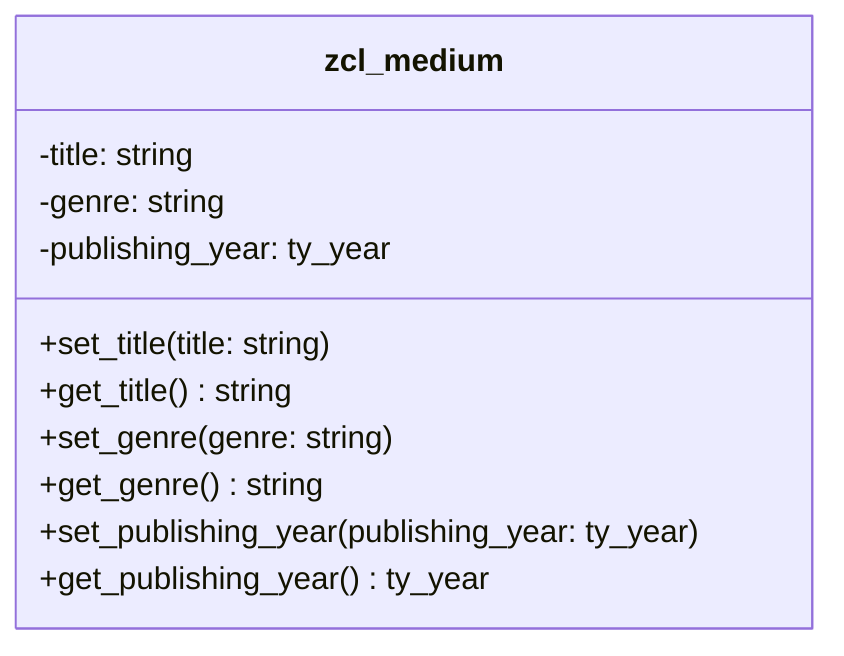

Erstelle die Klasse `ZCL_???_MEDIUM` anhand des abgebildeten Klassendiagramms.

## Klassendiagramm

```mermaid
classDiagram
   class zcl_medium {
      -title: string
      -genre: string
      -publishing_year: ty_year
      +set_title(title: string)
      +get_title() string
      +set_genre(genre: string)
      +get_genre() string
      +set_publishing_year(publishing_year: ty_year)
      +get_publishing_year() ty_year
   }
```
