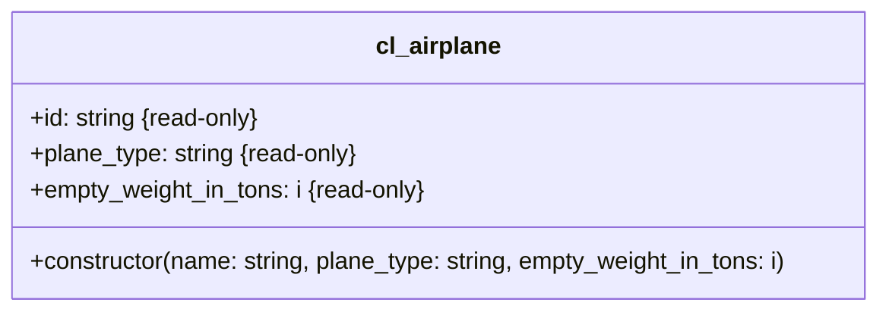

1. Passe die Klasse `ZCL_???_AIRPLANE` anhand des abgebildeten Klassendiagramms an
2. Passe die ausführbare Klasse `ZCL_???_MAIN_AIRPLANES` so an, dass sie keine Syntaxfehler mehr enthält

## Klassendiagramm

## Hinweise zur Klasse `ZCL_???_AIRPLANE`

Der Konstruktor soll alle Attribute initialisieren
