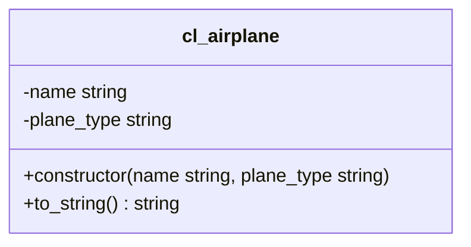

1. Passe die Klasse `ZCL_???_AIRPLANE` anhand des abgebildeten Klassendiagramms an
2. Passe das ABAP-Programm `Z???_MAIN_AIRPLANES` so an, dass es keine Syntaxfehler mehr enthält

## Klassendiagramm

## Hinweise zur Klasse `ZCL_???_AIRPLANE`

Der Konstruktor soll alle Attribute initialisieren
