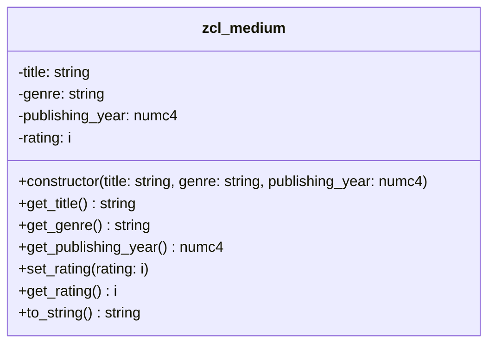

1. Passe die Klasse `ZCL_???_MEDIUM` anhand des abgebildeten Klassendiagramms an
2. Passe die ausführbare Klasse `ZCL_???_MAIN_MEDIA` so an, dass sie keine Syntaxfehler mehr enthält

## Klassendiagramm

```mermaid
classDiagram
   class zcl_medium {
      -title: string
      -genre: string
      -publishing_year: numc4
      -rating: i
      +constructor(title: string, genre: string, publishing_year: numc4)
      +get_title() string      
      +get_genre() string      
      +get_publishing_year() numc4
      +set_rating(rating: i)
      +get_rating() i
      +to_string() string
   }
```

## Hinweise zur Klasse `ZCL_???_MEDIUM`

Der Konstruktor soll alle Attribute initialisieren.
