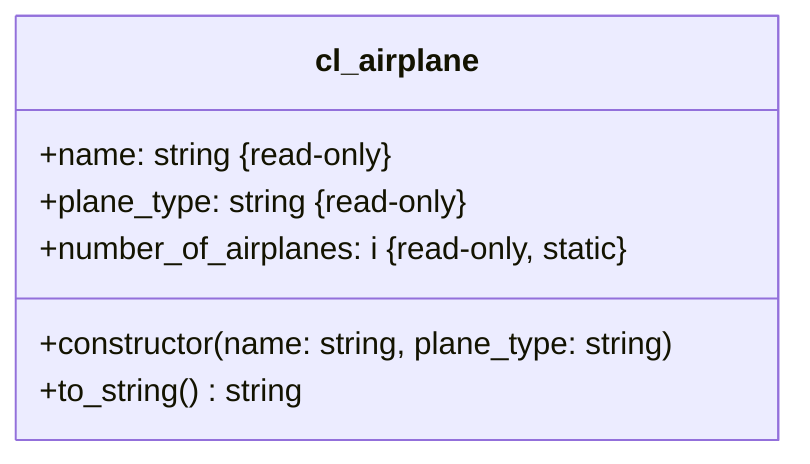

1. Passe die Klasse `ZCL_???_AIRPLANE` anhand des abgebildeten Klassendiagramms an
2. Passe das ABAP-Programm `Z???_MAIN_AIRPLANES` so an, dass vor und nach den Objekterzeugungen das Klassenattribut `NUMBER_OF_AIRPLANES` ausgegeben wird

## Klassendiagramm

## Hinweise zur Klasse `ZCL_???_AIRPLANE`

Passe den Konstruktor so an, dass beim Erzeugen eines Flugzeugs die Anzahl der Flugzeuge um Eins erhöht wird
