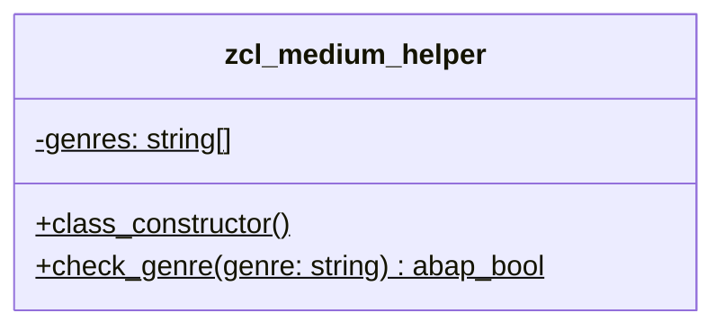

1. Erstelle die Klasse `ZCL_???_MEDIUM_HELPER` anhand des abgebildeten Klassendiagramms
2. Passe die ausführbare Klasse `ZCL_???_MAIN_MEDIA` so an, dass mit Hilfe der Klassenmethode `CHECK_GENRE` der Klasse `ZCL_???_MEDIUM_HELPER` überprüft wird, ob die verwendeten Genres gültig sind

## Klassendiagramm

```mermaid
classDiagram
   class zcl_medium_helper {
      -genres: string[]$
      +class_constructor()$
      +check_genre(genre: string) abap_bool$
   }
```

## Hinweise zur Klasse `ZCL_???_MEDIUM_HELPER`

- Der Klassenkonstruktor soll der Genreliste mehrere Genres zuweisen
- Die Methode `CHECK_GENRE` soll zurückgeben, ob das eingehende Genre in der Genreliste enthalten ist
