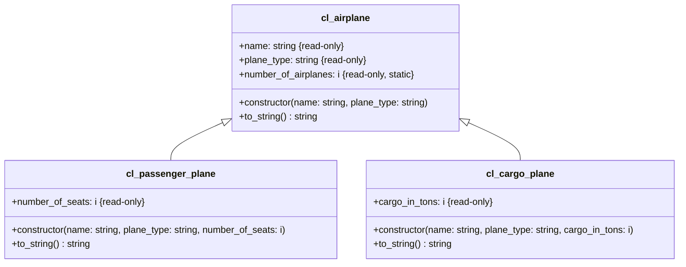

1. Erstelle die Klassen `ZCL_???_PASSENGER_PLANE` und `ZCL_???_CARGO_PLANE` anhand des abgebildeten Klassendiagramms
2. Passe das ABAP-Programm `Z???_MAIN_AIRPLANES` so an, dass statt gewöhnlichen Flugzeugen Passagier- und Frachtflugzeuge erzeugt werden

## Klassendiagramm

## Hinweise zur Klasse `ZCL_???_CARGO_PLANE` und zur Klasse `ZCL_???_PASSENGER_PLANE`

- Der Konstruktor soll alle Attribute initialisieren
- Die Methode `STRING TO_STRING()` soll alle Instanzattribute zu einer Zeichenkette zusammenfassen und diese zurückgeben
