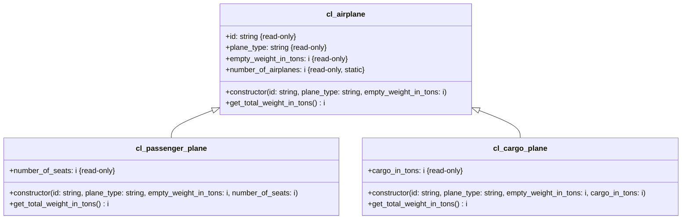

1. Erstelle die Klassen `ZCL_???_PASSENGER_PLANE` und `ZCL_???_CARGO_PLANE` anhand des abgebildeten Klassendiagramms
2. Passe die ausführbare Klasse `ZCL_???_MAIN_AIRPLANES` so an, dass statt gewöhnlichen Flugzeugen Passagier- und Frachtflugzeuge erzeugt werden

## Klassendiagramm

## Hinweise zur Klasse `ZCL_???_AIRPLANE`

- Der Konstruktor soll alle Attribute initialisieren
- Die Methode `GET_TOTAL_WEIGHT_IN_TONS` soll das Gesamtgewicht nach der Formel _[Leergewicht] \* 1,1_ zurückgeben

## Hinweise zur Klasse `ZCL_???_PASSENGER_PLANE`

- Der Konstruktor soll alle Attribute initialisieren
- Die Methode `GET_TOTAL_WEIGHT_IN_TONS` soll das Gesamtgewicht nach der Formel _[Leergewicht] \* 1,1 + [Sitzplätze] \* 0,08_ zurückgeben

## Hinweise zur Klasse `ZCL_???_CARGO_PLANE`

- Der Konstruktor soll alle Attribute initialisieren
- Die Methode `GET_TOTAL_WEIGHT_IN_TONS` soll das Gesamtgewicht nach der Formel _[Leergewicht] \* 1,1 + [Frachtkapazität]_ zurückgeben
