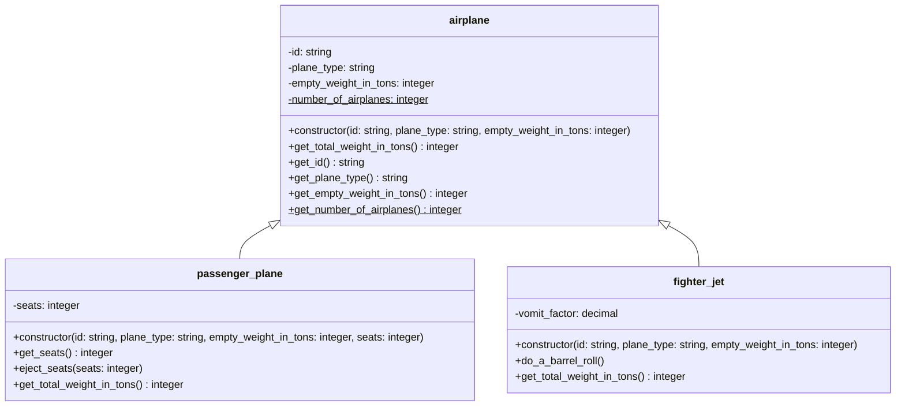

1. Erstelle die Klassen `ZCL_???_PASSENGER_PLANE` und `ZCL_???_FIGHTER_JET` anhand des abgebildeten Klassendiagramms
2. Passe die ausführbare Klasse `ZCL_???_MAIN_AIRPLANES` so an, dass statt gewöhnlichen Flugzeugen Passagier- und Kampfflugzeuge erzeugt werden

## Klassendiagramm

```mermaid
classDiagram
   airplane <|-- passenger_plane
   airplane <|-- fighter_jet

   class airplane {
      -id: string
      -plane_type: string
      -empty_weight_in_tons: integer
      -number_of_airplanes: integer$
      +constructor(id: string, plane_type: string, empty_weight_in_tons: integer)
      +get_total_weight_in_tons() integer
      +get_id() string
      +get_plane_type() string
      +get_empty_weight_in_tons() integer
      +get_number_of_airplanes() integer$
   }

   class passenger_plane {
      -seats: integer
      +constructor(id: string, plane_type: string, empty_weight_in_tons: integer, seats: integer)
      +get_seats() integer
      +eject_seats(seats: integer)
      +get_total_weight_in_tons() integer
   }

   class fighter_jet {
      -vomit_factor: decimal
      +constructor(id: string, plane_type: string, empty_weight_in_tons: integer)
      +do_a_barrel_roll()
      +get_total_weight_in_tons() integer
   }
```

## Hinweise zur Klasse `ZCL_???_AIRPLANE`

- Die Methode `GET_TOTAL_WEIGHT_IN_TONS` gibt das Gesamtgewicht nach der Formel _[Leergewicht] \* 1,1_ zurück

## Hinweise zur Klasse `ZCL_???_PASSENGER_PLANE`

- Der Konstruktor soll alle Attribute initialisieren
- Die Methode `EJECT_SEATS` soll die eingehende Anzahl an Sitzen aus dem Flugzeug schleudern
- Die Methode `GET_TOTAL_WEIGHT_IN_TONS` soll das Gesamtgewicht nach der Formel _[Leergewicht] \* 1,1 + [Sitzplätze] \* 0,08_ zurückgeben

## Hinweise zur Klasse `ZCL_???_FIGHTER_JET`

- Der Konstruktor soll alle Attribute initialisieren
- Die Methode `DO_A_BARREL_ROLL` soll den Kotzfaktor um 0.25 erhöhen. Für den Fall, dass der Kotzfaktor den Wert 1 übersteigt, soll die Ausnahme `ZCX_ABAP_VOMIT_OVERFLOW` ausgelöst werden 
- Die Methode `GET_TOTAL_WEIGHT_IN_TONS` soll das Gesamtgewicht nach der Formel _[Leergewicht] \* 1,1 + 0,08_ zurückgeben
