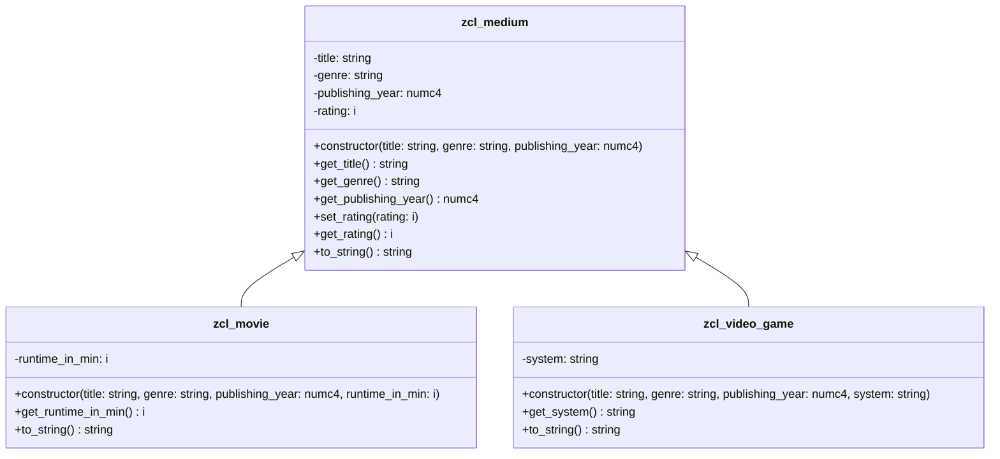

1. Erstelle die Klassen `ZCL_???_MOVIE` und `ZCL_???_VIDEO_GAME` anhand des abgebildeten Klassendiagramms
2. Passe die ausführbare Klasse `ZCL_???_MAIN_MEDIA` so an, dass statt unspezifischen Medien Filme und Videospiele erzeugt werden

## Klassendiagramm

```mermaid
classDiagram
   zcl_medium <|-- zcl_movie
   zcl_medium <|-- zcl_video_game

   class zcl_medium {
      -title: string
      -genre: string
      -publishing_year: numc4
      -rating: i
      +constructor(title: string, genre: string, publishing_year: numc4)
      +get_title() string      
      +get_genre() string      
      +get_publishing_year() numc4
      +set_rating(rating: i)
      +get_rating() i
      +to_string() string
   }

   class zcl_movie {
      -runtime_in_min: i
      +constructor(title: string, genre: string, publishing_year: numc4, runtime_in_min: i)
      +get_runtime_in_min() i
      +to_string() string
   }

   class zcl_video_game {
      -system: string
      +constructor(title: string, genre: string, publishing_year: numc4, system: string)
      +get_system() string
      +to_string() string
   }
```

## Hinweise zur Klasse `ZCL_???_MOVIE`

- Der Konstruktor soll alle Attribute initialisieren. Für den Fall, dass die eingehende Laufzeit in Minuten initial ist, soll die Ausnahme `ZCX_???_INITIAL_PARAMETER` ausgelöst werden
- Die Methode `TO_STRING` soll alle Attribute als Zeichenkette in der Form _[Titel] ([Erscheinungsjahr]): [Genre], [Bewertung]%, [Laufzeit in Minuten]min_ zurückgeben.

## Hinweise zur Klasse `ZCL_???_VIDEO_GAME`

- Der Konstruktor soll alle Attribute initialisieren. Für den Fall, dass das eingehende System initial ist, soll die Ausnahme `ZCX_???_INITIAL_PARAMETER` ausgelöst werden
- Die Methode `TO_STRING` soll alle Attribute als Zeichenkette in der Form _[Titel] ([System]): [Genre], [Erscheinungsjahr], [Bewertung]%_ zurückgeben.
