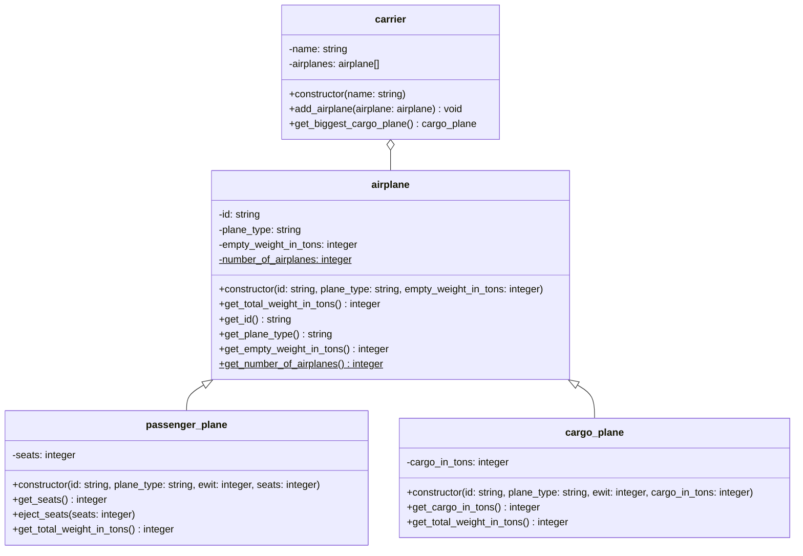

1. Lege den globalen Tabellentypen `Z???_AIRPLANES` anhand der abgebildeten Informationen an
2. Erstelle die Klasse `ZCL_???_CARRIER` anhand des abgebildeten Klassendiagramms
3. Passe das ABAP-Programm `Z???_MAIN_AIRPLANES` so an, dass neben den Flugzeugen auch eine Fluggesellschaft erzeugt wird. Weise die Flugzeuge der Fluggesellschaft zu und gib alle Informationen der Fluggesellschaft auf dem Bildschirm aus.

## Informationen zum globalen Tabellentyp `Z???_AIRPLANES`

- Zeilentyp: `ZCL_???_AIRPLANE` (Reference to Class/Interface)
- Tabellenart: Standardtabelle
- Primärschlüssel: Standardschlüssel

## Klassendiagramm

```mermaid
classDiagram
   carrier o-- airplane
   airplane <|-- passenger_plane
   airplane <|-- cargo_plane

   class airplane {
      -id: string
      -plane_type: string
      -empty_weight_in_tons: integer
      -number_of_airplanes: integer$
      +constructor(id: string, plane_type: string, empty_weight_in_tons: integer)
      +get_total_weight_in_tons() integer
      +get_id() string
      +get_plane_type() string
      +get_empty_weight_in_tons() integer
      +get_number_of_airplanes() integer$
   }

   class passenger_plane {
      -seats: integer
      +constructor(id: string, plane_type: string, ewit: integer, seats: integer)
      +get_seats() integer
      +eject_seats(seats: integer)
      +get_total_weight_in_tons() integer
   }

   class cargo_plane {
      -cargo_in_tons: integer
      +constructor(id: string, plane_type: string, ewit: integer, cargo_in_tons: integer)
      +get_cargo_in_tons() integer
      +get_total_weight_in_tons() integer
   }

   class carrier {
      -name: string
      -airplanes: airplane[]
      +constructor(name: string)
      +add_airplane(airplane: airplane) void
      +get_biggest_cargo_plane() cargo_plane
   }
```

## Hinweise zur Klasse `ZCL_???_CARRIER`

- Der Konstruktor soll alle Attribute initialisieren
- Die Methode `ADD_AIRPLANE` soll der Flugzeugliste das eingehende Flugzeug hinzufügen
- Die Methode `GET_BIGGEST_CARGO_PLANE` soll das Frachtflugzeug mit dem höchsten Gesamtgewicht zurückgeben
