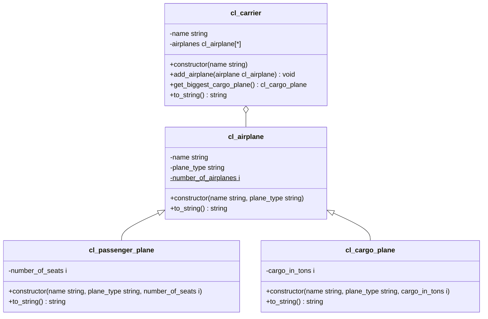

1. Lege den globalen Tabellentypen `Z???_AIRPLANES` anhand der abgebildeten Informationen an
2. Erstelle die Klasse `ZCL_???_CARRIER` anhand des abgebildeten Klassendiagramms
3. Passe das ABAP-Programm `Z???_MAIN_AIRPLANES` so an, dass neben den Flugzeugen auch eine Fluggesellschaft erzeugt wird. Die Flugzeuge sollen der Fluggesellschaft zugewiesen und alle Informationen der Fluggesellschaft auf dem Bildschirm ausgegeben
   werden

## Informationen zum globalen Tabellentyp `Z???_AIRPLANES`

- Referenztyp: `ZCL_???_AIRPLANE`
- Tabellenart: Standardtabelle
- Primärschlüssel: Standardschlüssel

## Klassendiagramm

## Hinweise zur Klasse `ZCL_???_CARRIER`

- Der Konstruktor soll alle Attribute initialisieren
- Die Methode `ZCL_???_CARGO_PLANE GET_BIGGEST_CARGO_PLANE()` soll das Frachtflugzeug mit der größten Frachtkapazität zurückgeben
- Die Methode `VOID TO_STRING()` soll alle Instanzattribute zu einer Zeichenkette zusammenfassen und diese zurückgeben
