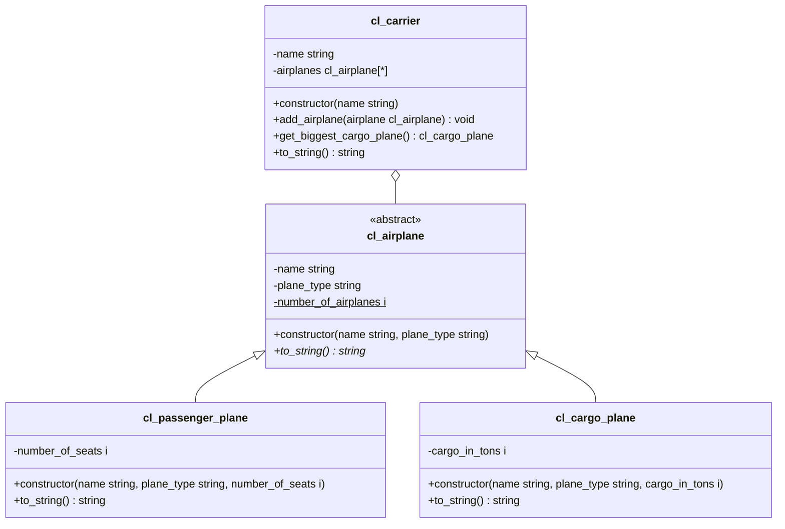

Passe die Klasse `ZCL_???_AIRPLANE` anhand des abgebildeten Klassendiagramms an.

## Klassendiagramm

```mermaid
classDiagram
    cl_carrier o-- cl_airplane
    cl_airplane <|-- cl_passenger_plane
    cl_airplane <|-- cl_cargo_plane

    class cl_airplane {
      <<abstract>>
      -name string
      -plane_type string
      -number_of_airplanes i$
      +constructor(name string, plane_type string)
      +to_string()* string
    }

    class cl_passenger_plane {
      -number_of_seats i
      +constructor(name string, plane_type string, number_of_seats i)
      +to_string() string
    }

    class cl_cargo_plane {
      -cargo_in_tons i
      +constructor(name string, plane_type string, cargo_in_tons i)
      +to_string() string
    }

    class cl_carrier {
      -name string
      -airplanes cl_airplane[*]
      +constructor(name string)
      +add_airplane(airplane cl_airplane) void
      +get_biggest_cargo_plane() cl_cargo_plane
      +to_string() string
    }
```
