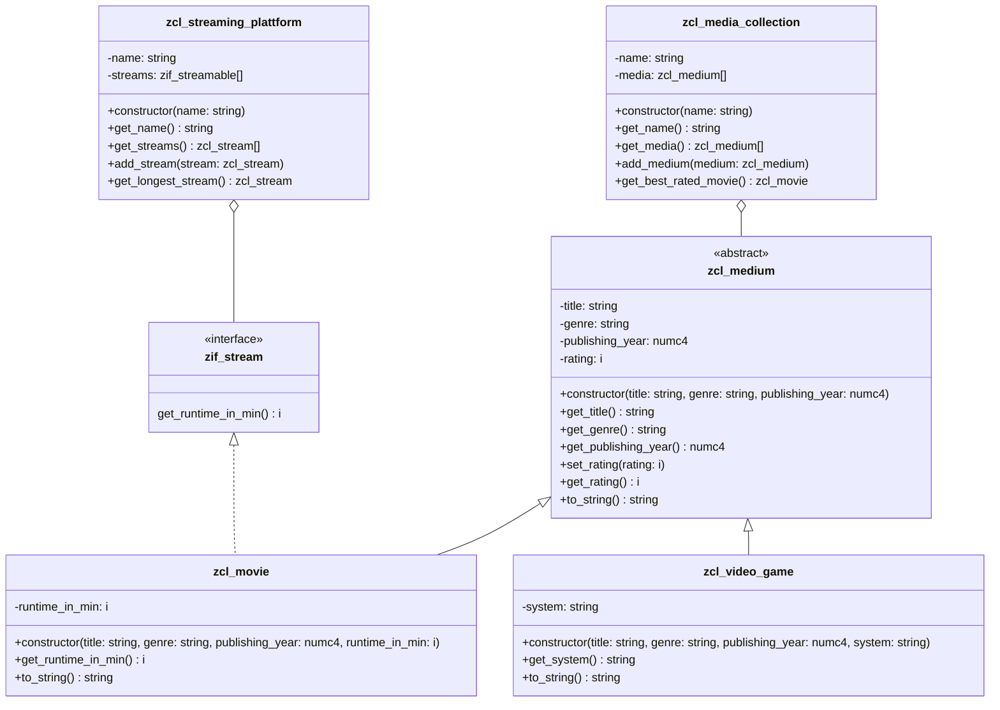

1. Erstelle das Interface `ZIF_???_STREAMABLE`
2. Passe die Klassen `ZCL_???_MOVIE` und `ZCL_???_MEDIUM` anhand des abgebildeten Klassendiagramms an
3. Erstelle die Klasse `ZCL_???_STREAMING_PLATTFORM` anhand des abgebildeten Klassendiagramms
4. Passe die ausführbare Klasse `Z???_MAIN_MEDIA` wie folgt an:
    - so an, dass neben den Flugzeugen und der Fluggesellschaft auch ein Reisebüro erzeugt wird. Weise die Fluggesellschaft dem Reisebüro zu und gib alle Informationen des Reisebüros auf dem Bildschirm aus.

## Klassendiagramm

## Hinweis zur Klasse `ZCL_???_STREAMING_PLATTFORM`

- Der Konstruktor soll alle Attribute initialisieren
- Die Methode `ADD_STREAM` soll der Streamliste den eingehenden Stream hinzufügen
- Die Methode `GET_LONGEST_STREAM` soll den längsten Stream zurückgeben
