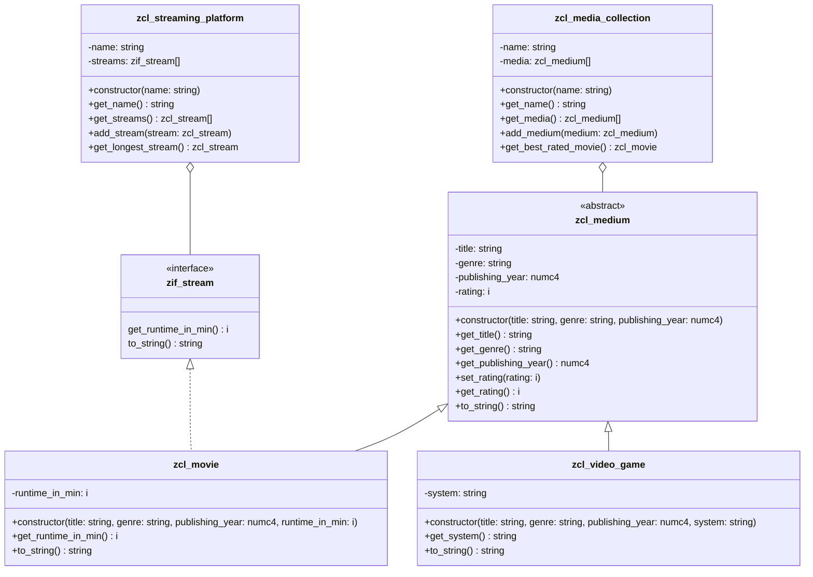

1. Erstelle das Interface `ZIF_???_STREAMABLE`
2. Passe die Klassen `ZCL_???_MOVIE` und `ZCL_???_MEDIUM` anhand des abgebildeten Klassendiagramms an
3. Erstelle die Klasse `ZCL_???_STREAMING_PLATTFORM` anhand des abgebildeten Klassendiagramms
4. Passe die ausführbare Klasse `Z???_MAIN_MEDIA` wie folgt an:
    - Erstelle neben den Medien und der Mediensammlung auch einen Streaming-Plattform
    - Füge die Filme der Streaming-Plattform hinzu
    - Gib alle Informationen der Streaming-Plattform auf dem Bildschirm aus

## Klassendiagramm



## Hinweis zur Klasse `ZCL_???_STREAMING_PLATFORM`

- Der Konstruktor soll alle Attribute initialisieren
- Die Methode `ADD_STREAM` soll der Streamliste den eingehenden Stream hinzufügen
- Die Methode `GET_LONGEST_STREAM` soll den längsten Stream zurückgeben

## Beispielhafte Konsolenausgabe

```
Media Collection: My Movie and Videogame Collection

Media:
Fight Club (1999): Thriller, 67%, 139min
Metroid Dread (NSW): Science-Fiction, 2021, 88%
The Godfather: Part II (1974): Drama, 90%, 302min

Best Rated Movie: The Godfather: Part II (1974): Drama, 90%, 302min
------------------------------------------------------------
Streaming Platform: Netflix

Streams:
Fight Club (1999): Thriller, 67%, 139min
The Godfather: Part II (1974): Drama, 90%, 302min (1974): Drama, 90%, 302min

Longest Stream: The Godfather: Part II (1974): Drama, 90%, 302min
```
