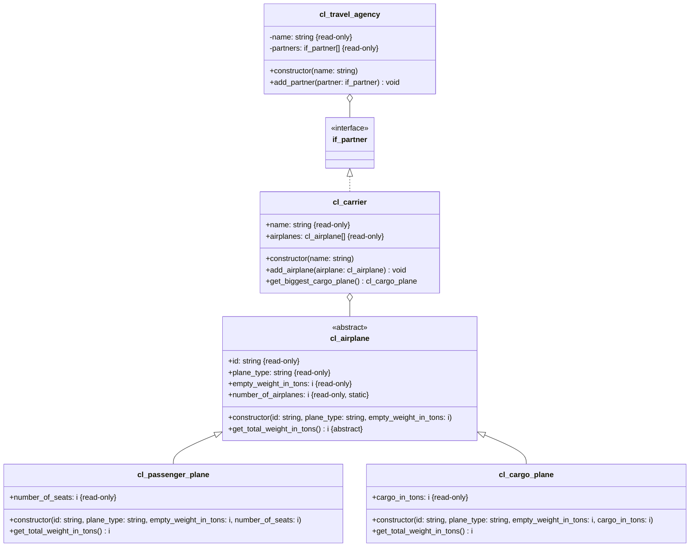

1. Erstelle die Schnittstelle `ZIF_???_PARTNER` anhand des abgebildeten Klassendiagramms
2. Passe die Klasse `ZCL_???_CARRIER` anhand des abgebildeten Klassendiagramms an
3. Lege den globalen Tabellentypen `Z???_PARTNERS` anhand der abgebildeten Informationen an
4. Erstelle die Klasse `ZCL_???_TRAVEL_AGENCY` anhand des abgebildeten Klassendiagramms
5. Passe das ABAP-Programm `Z???_MAIN_AIRPLANES` so an, dass neben den Flugzeugen und der Fluggesellschaft auch ein Reisebüro erzeugt wird. Weise die Fluggesellschaft dem Reisebüro zu und gib alle Informationen des Reisebüros auf dem Bildschirm aus.

## Informationen zum globalen Tabellentyp `Z???_PARTNERS`

- Zeilentyp: `ZIF_???_PARTNER` (Reference to Class/Interface)
- Tabellenart: Standardtabelle
- Primärschlüssel: Standardschlüssel

## Klassendiagramm

```mermaid
classDiagram
   cl_carrier o-- cl_airplane
   cl_airplane <|-- cl_passenger_plane
   cl_airplane <|-- cl_cargo_plane
   if_partner <|.. cl_carrier
   cl_travel_agency o-- if_partner

   class cl_airplane {
      <<abstract>>
      +id: string &#123read-only&#125
      +plane_type: string &#123read-only&#125
      +empty_weight_in_tons: i &#123read-only&#125
      +number_of_airplanes: i &#123read-only, static&#125
      +constructor(id: string, plane_type: string, empty_weight_in_tons: i)
      +get_total_weight_in_tons() i &#123abstract&#125
   }

   class cl_passenger_plane {
      +number_of_seats: i &#123read-only&#125
      +constructor(id: string, plane_type: string, empty_weight_in_tons: i, number_of_seats: i)
      +get_total_weight_in_tons() i
   }

   class cl_cargo_plane {
      +cargo_in_tons: i &#123read-only&#125
      +constructor(id: string, plane_type: string, empty_weight_in_tons: i, cargo_in_tons: i)
      +get_total_weight_in_tons() i
   }

   class cl_carrier {
      +name: string &#123read-only&#125
      +airplanes: cl_airplane[] &#123read-only&#125
      +constructor(name: string)
      +add_airplane(airplane: cl_airplane) void
      +get_biggest_cargo_plane() cl_cargo_plane
   }

   class if_partner {
      <<interface>>
   }

   class cl_travel_agency {
      -name: string &#123read-only&#125
      -partners: if_partner[] &#123read-only&#125
      +constructor(name: string)
      +add_partner(partner: if_partner) void
   }
```

## Hinweis zur Klasse `ZCL_???_TRAVEL_AGENCY`

- Der Konstruktor initialisiert alle Attribute
- Die Methode `ADD_PARTNER` fügt der Partnerliste den eingehenden Partner hinzu
