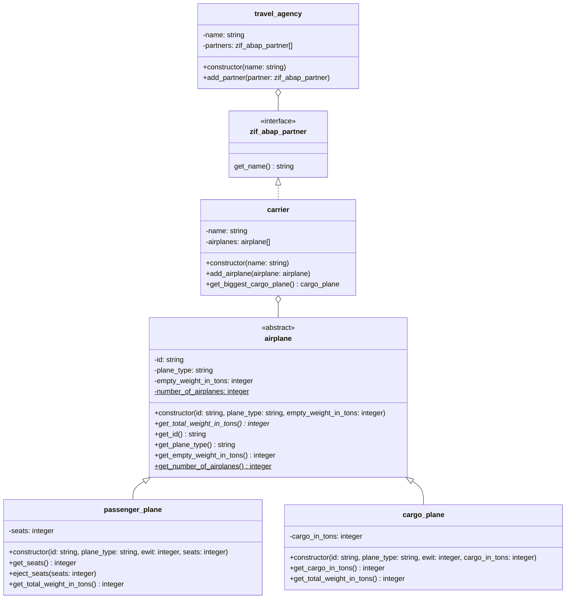

1. Passe die Klasse `ZCL_???_CARRIER` anhand des abgebildeten Klassendiagramms an
2. Erstelle die Klasse `ZCL_???_TRAVEL_AGENCY` anhand des abgebildeten Klassendiagramms
3. Passe das ABAP-Programm `Z???_MAIN_AIRPLANES` so an, dass neben den Flugzeugen und der Fluggesellschaft auch ein Reisebüro erzeugt wird. Weise die Fluggesellschaft dem Reisebüro zu und gib alle Informationen des Reisebüros auf dem Bildschirm aus.

## Klassendiagramm

```mermaid
classDiagram
   carrier o-- airplane
   airplane <|-- passenger_plane
   airplane <|-- cargo_plane
   zif_abap_partner <|.. carrier
   travel_agency o-- zif_abap_partner

   class airplane {
      <<abstract>>
      -id: string
      -plane_type: string
      -empty_weight_in_tons: integer
      -number_of_airplanes: integer$
      +constructor(id: string, plane_type: string, empty_weight_in_tons: integer)
      +get_total_weight_in_tons() integer*
      +get_id() string
      +get_plane_type() string
      +get_empty_weight_in_tons() integer
      +get_number_of_airplanes() integer$
   }

   class passenger_plane {
      -seats: integer
      +constructor(id: string, plane_type: string, ewit: integer, seats: integer)
      +get_seats() integer
      +eject_seats(seats: integer)
      +get_total_weight_in_tons() integer
   }

   class cargo_plane {
      -cargo_in_tons: integer
      +constructor(id: string, plane_type: string, ewit: integer, cargo_in_tons: integer)
      +get_cargo_in_tons() integer
      +get_total_weight_in_tons() integer
   }

   class carrier {
      -name: string
      -airplanes: airplane[]
      +constructor(name: string)
      +add_airplane(airplane: airplane)
      +get_biggest_cargo_plane() cargo_plane
   }

   class zif_abap_partner {
      <<interface>>
      get_name() string
   }

   class travel_agency {
      -name: string
      -partners: zif_abap_partner[]
      +constructor(name: string)
      +add_partner(partner: zif_abap_partner)
   }
```

## Hinweis zur Klasse `ZCL_???_TRAVEL_AGENCY`

- Der Konstruktor soll alle Attribute initialisieren
- Die Methode `ADD_PARTNER` soll der Partnerliste den eingehenden Partner hinzufügen
