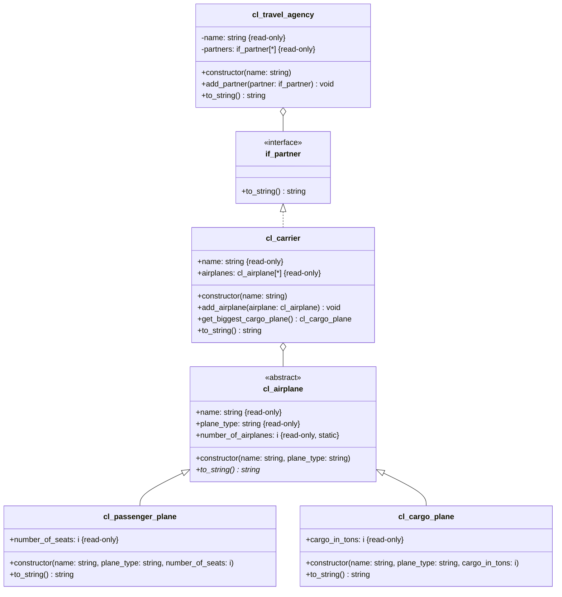

1. Erstelle die Schnittstelle `ZIF_???_PARTNER` anhand des abgebildeten Klassendiagramms
2. Passe die Klasse `ZCL_???_CARRIER` anhand des abgebildeten Klassendiagramms an
3. Lege den globalen Tabellentypen `Z???_PARTNERS` anhand der abgebildeten Informationen an
4. Erstelle die Klasse `ZCL_???_TRAVEL_AGENCY` anhand des abgebildeten Klassendiagramms
5. Passe das ABAP-Programm `Z???_MAIN_AIRPLANES` so an, dass neben den Flugzeugen und der Fluggesellschaft auch ein Reisebüro erzeugt wird. Die Fluggesellschaft soll dem Reisebüro zugewiesen und alle Informationen des Reisebüros auf dem Bildschirm ausgegeben
   werden

## Informationen zum globalen Tabellentyp `Z???_PARTNERS`

- Referenztyp: `ZIF_???_PARTNER`
- Tabellenart: Standardtabelle
- Primärschlüssel: Standardschlüssel

## Klassendiagramm

## Hinweise zum Klasse `ZCL_???_TRAVEL_AGENCY`

- Der Konstruktor soll alle Attribute initialisieren
- Die Methode `STRING TO_STRING()` soll alle Instanzattribute zu einer Zeichenkette zusammenfassen und diese zurückgeben
