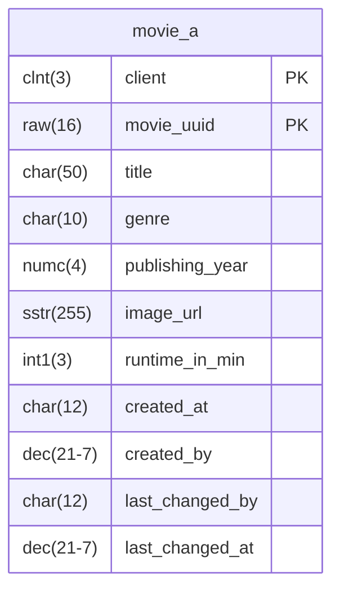

- Erstelle für die abgebildete Datenbanktabelle `ZABAP_MOVIE_A` die Restricted Interface View `ZR_???_Movie`
- Erstelle für die erstellte Restricted Interface View die Projection View `ZC_???_Movie`
- Erstelle für die erstellte Projection View die Service Definition `ZUI_???_MOVIE_V2`
- Erstelle für die erstellte Service Definition das Service Binding `ZUI_???_MOVIE_V2`
- Erstelle für die erstellte Projection View die Metadata Extension `ZC_???_MOVIE`

## Datenbanktabelle `ZABAP_MOVIE_A`

## Hinweis zur Restricted Interface View `ZR_???_Movie`

Die Restricted Interface View soll alle Felder der Datenbanktabelle ausgeben.

## Hinweis zur Projection View `ZC_???_Movie`

Die Projection View soll alle Felder der Restricted Interface View ausgeben.

## Hinweise zur Metadata Extension `ZC_???_MOVIE`

### Hinweise zum ListReport

- Filme sollen nach den Feldern `Genre`, `PublishingYear` und `RuntimeInMin` gefiltert werden können
- Filme sollen nach ihrem Titel mit einem Unschärfwert von 0,7 durchsucht werden können
- Als Tabellenüberschrift soll der Wert `Movies` angezeigt werden
- Standardmäßig sollen die Spalten `Title`, `Genre`, `PublishingYear` und `RuntimeInMin` angezeigt werden

### Hinweise zur ObjectPage

- Als Überschrift soll der Wert `Movie` angezeigt werden
- Als Kopfzeilen-ID soll der Wert des Feldes `Title` angezeigt werden
- Als Kopfzeilen-Beschreibung soll der Wert des Feldes `PublishingYear` angezeigt werden
- Als Kopfzeilen-Abbildung soll das verlinkte Bild des Feldes `ImageURL` angezeigt werden
- Die Felder `Title`, `Genre`, `PublishingYear`, `RuntimeInMin` und `ImageURL` sollen in der Feldgruppe `Movie Details` angezeigt werden
- Die Felder `MovieUUID`, `CreatedAt`, `CreatedBy`, `LastChangedAt` und `LastChangedBy` sollen in der Feldgruppe `Administrative Data` angezeigt werden
