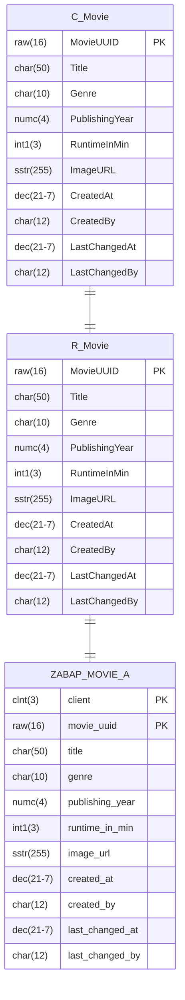

- Erstelle mit Hilfe des abgebildeten ER-Modells die BO Base View `ZR_???_Movie` sowie die BO Projection View `ZC_???_Movie`
- Erstelle für die BO Projection View für Filme die Service Definition `ZUI_???_MOVIE`
- Erstelle für die Service Definition für Filme das Service Binding `ZUI_???_MOVIE_O2`
- Erstelle für die BO Projection View für Filme die Metadata Extension `ZC_???_MOVIE`

## ER-Modell

## Hinweise zur Metadata Extension `ZC_???_MOVIE`

### Hinweise zum ListReport

- Filme sollen nach den Feldern `Genre`, `PublishingYear` und `RuntimeInMin` gefiltert werden können
- Filme sollen nach ihrem Titel mit einem Unschärfwert von 0,7 durchsucht werden können
- Als Tabellenüberschrift soll der Wert `Movies` angezeigt werden
- Standardmäßig sollen die Spalten `Title`, `Genre`, `PublishingYear` und `RuntimeInMin` angezeigt werden
- Als zusätzliche Spalte soll das verlinkte Bild des Feldes `ImageURL` angezeigt werden

### Hinweise zur ObjectPage

- Als Kopfzeilen-Titel soll der Wert des Feldes `Title` angezeigt werden
- Als Kopfzeilen-Beschreibung soll der Wert des Feldes `PublishingYear` angezeigt werden
- Als Kopfzeilen-Abbildung soll das verlinkte Bild des Feldes `ImageURL` angezeigt werden
- Die Felder `Title`, `Genre`, `PublishingYear`, `RuntimeInMin` und `ImageURL` sollen in der Feldgruppe `Movie Details` angezeigt werden
- Die Felder `MovieUUID`, `CreatedAt`, `CreatedBy`, `LastChangedAt` und `LastChangedBy` sollen in der Feldgruppe `Administrative Data` angezeigt werden
